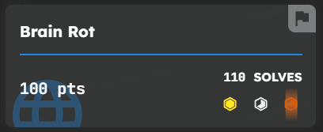
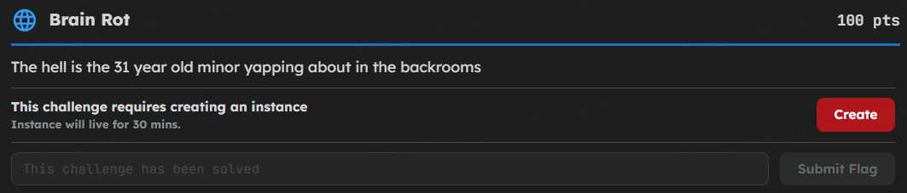
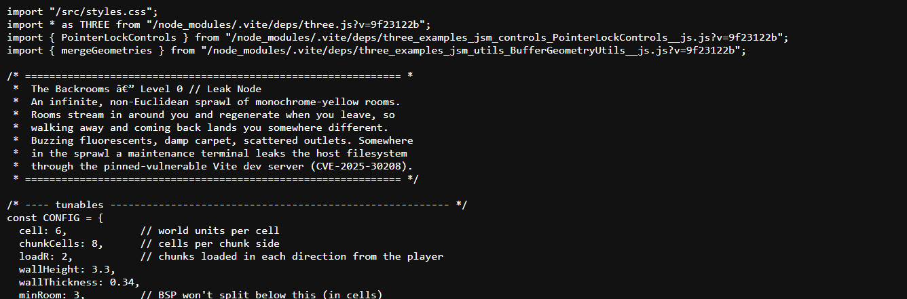
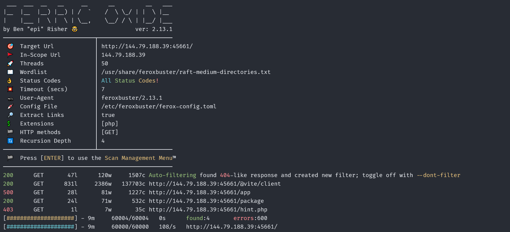
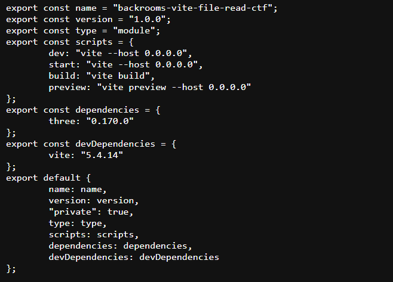
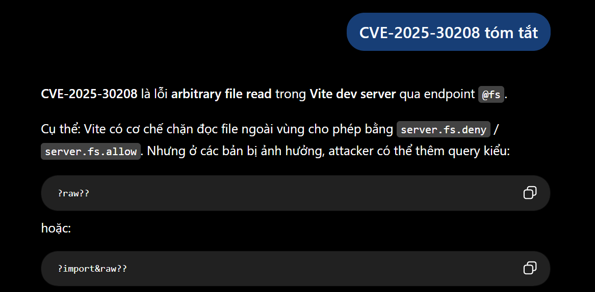
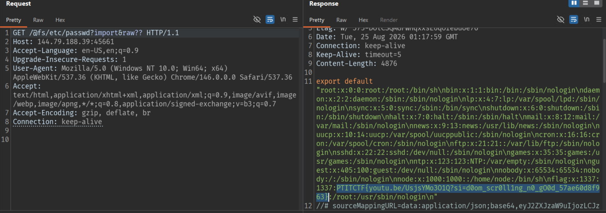

## Description



## Recon

Đọc source, thấy có file `main.js`:



```text
Somewhere in the sprawl a maintenance terminal leaks the host filesystem
through the pinned-vulnerable Vite dev server (CVE-2025-30208).
```

Quét endpoint:



File `package.json` xác nhận phiên bản Vite là `5.4.14`.



Vite có endpoint đặc biệt `/@fs/` dùng để phục vụ các file nằm ngoài thư mục root của project theo đường dẫn tuyệt đối trên filesystem.



## Bypass CVE-2025-30208

CVE-2025-30208 là lỗ hổng của Vite dev server: có thể vượt qua cơ chế allow list của `/@fs/` bằng cách thêm query string `?raw??` hoặc `?import&raw??` vào cuối đường dẫn. Vite dùng dấu `?` để cắt bỏ query khi kiểm tra allow list, nhưng phần `??` dư ra khiến chuỗi sau khi xử lý không còn khớp với đường dẫn thực, làm bước kiểm tra bị bỏ qua và file vẫn được đọc và trả về nguyên văn.



## Flag

```text
PTITCTF{youtu.be/UsjsYMo3O1Q?si=d0om_scr0ll1ng_n0_gO0d_57ae60d8f963}
```
