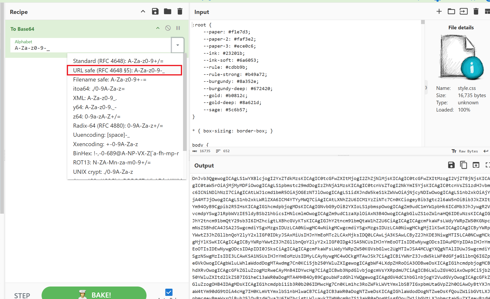

# You Are Kidding Me

## Inspecting the website

Visiting `/admin` directly returns `401 Unauthorized`. Logging in returns a JWT:


Header:

```json
{
  "alg": "HS256",
  "kid": "reader.key",
  "typ": "JWT"
}
```

Payload:

```json
{
  "sub": "reader",
  "role": "reader"
}
```

Visiting `/admin` with this token returns `403 Forbidden`:

```text
Your pass checks out as reader. The Editor's Desk is for editor passes only.
```

The server checks the `role` claim, so it must be changed to `role=editor`.

The header contains `kid=reader.key`. The `kid` field is commonly used by the server to select the key used to verify a JWT. If the server uses a fixed allowlist, changing this field makes the token invalid. However, if the server concatenates `kid` directly into a file path, path traversal may be possible.

## Creating an editor JWT

Use this header:

```json
{
  "alg": "HS256",
  "kid": "../static/style.css",
  "typ": "JWT"
}
```

Use this payload:

```json
{
  "sub": "reader",
  "role": "editor"
}
```

The secret is the entire contents of `/static/style.css`. Download the file:


Import it into CyberChef and encode it as B64url:



Paste the output into the secret field:


Send the token in a cookie to `/admin`:


## Flag

```text
sun{h0tw1r3d_4dm1n_jwt}
```
